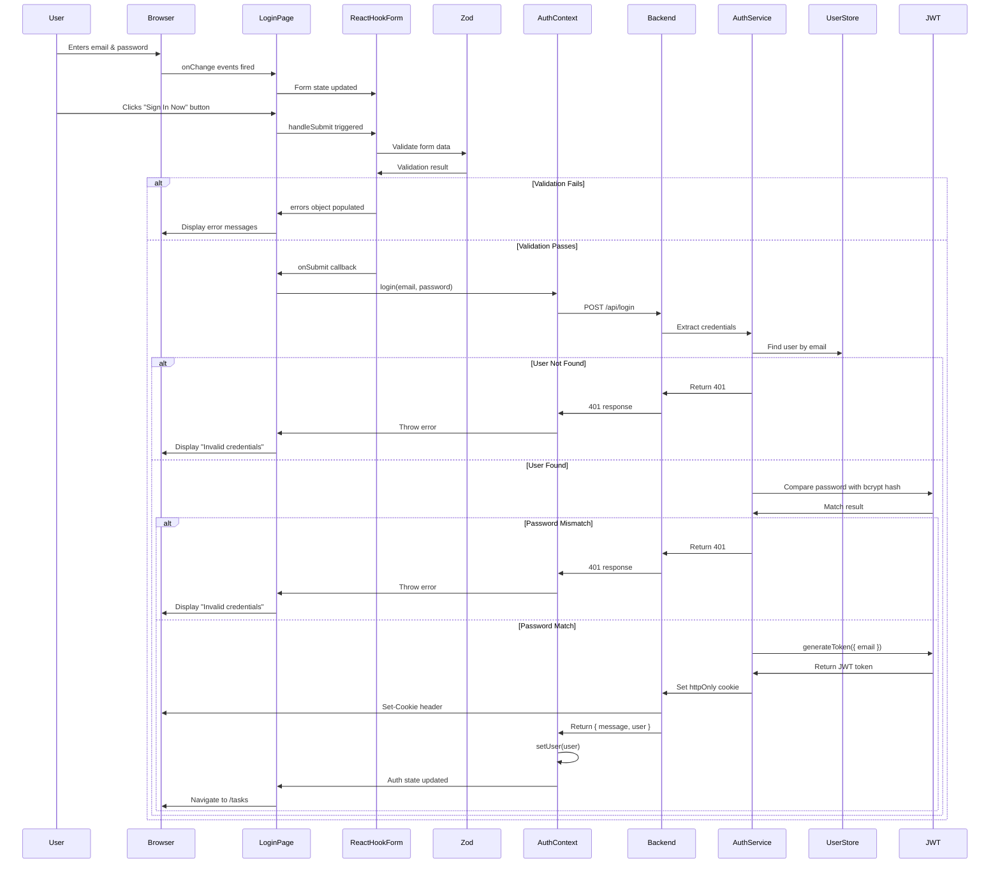
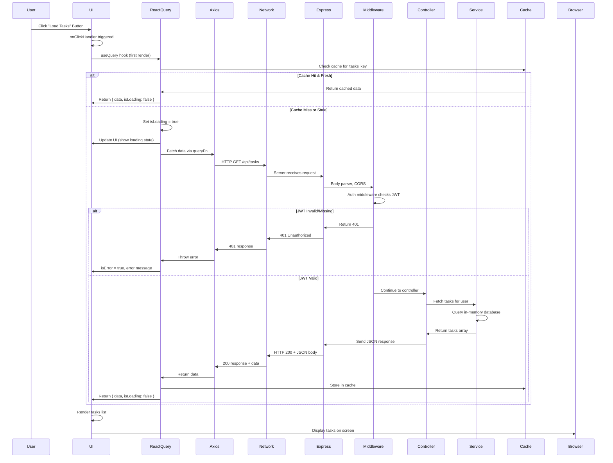
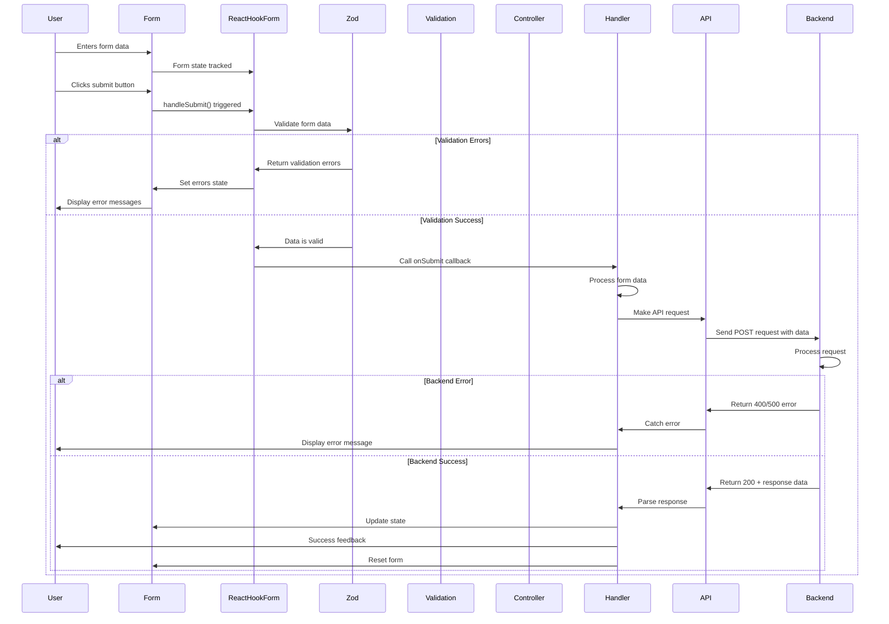
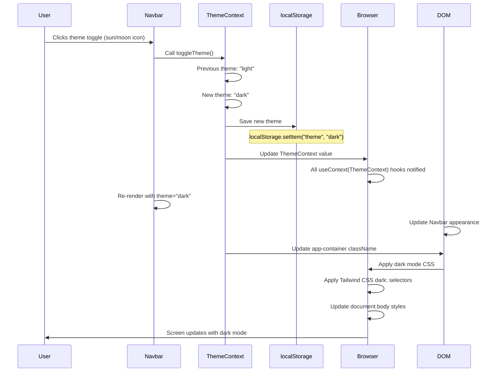
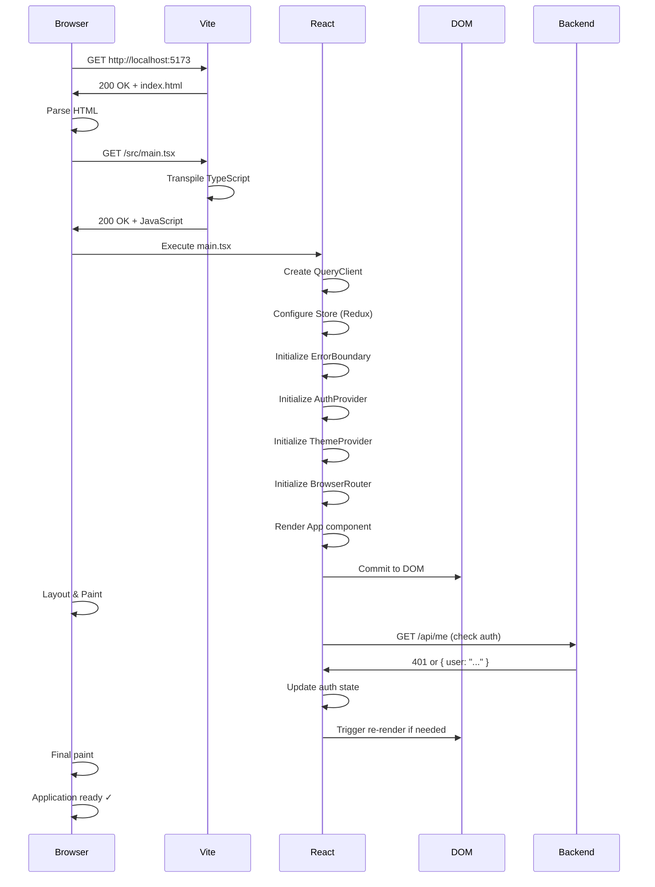
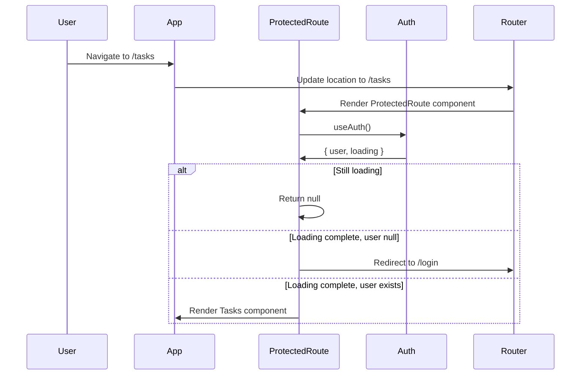
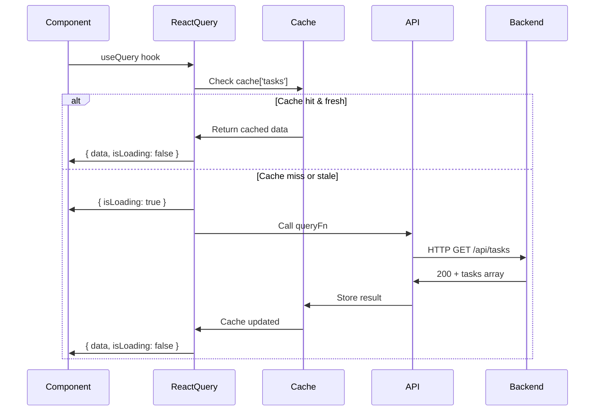

# Task Manager Application - Complete Execution Flow

**A Software Architect's Deep Dive into Application Internals**

This document explains the complete execution flow of a production-grade full-stack task manager application built with modern React, TypeScript, and Express.js. Every system component, middleware, hook, and interaction is documented in detail.

---

## 1. High-Level Architecture

### System Components Overview

```
┌─────────────────────────────────────────────────────────────────┐
│                      USER BROWSER                               │
├─────────────────────────────────────────────────────────────────┤
│  ┌──────────────────────────────────────────────────────────┐   │
│  │        VITE DEV SERVER (Port 5173)                       │   │
│  │  ┌────────────────────────────────────────────────────┐  │   │
│  │  │          REACT APPLICATION (SPA)                  │  │   │
│  │  │  ┌──────────────────────────────────────────────┐ │  │   │
│  │  │  │  Error Boundary                              │ │  │   │
│  │  │  │  ┌────────────────────────────────────────┐ │ │  │   │
│  │  │  │  │ React Query DevTools                   │ │ │  │   │
│  │  │  │  ├────────────────────────────────────────┤ │ │  │   │
│  │  │  │  │ Query Client (React Query)             │ │ │  │   │
│  │  │  │  ├────────────────────────────────────────┤ │ │  │   │
│  │  │  │  │ Redux Store (Toolkit)                  │ │ │  │   │
│  │  │  │  ├────────────────────────────────────────┤ │ │  │   │
│  │  │  │  │ Auth Context (Provider)                │ │ │  │   │
│  │  │  │  ├────────────────────────────────────────┤ │ │  │   │
│  │  │  │  │ Theme Context (Provider)               │ │ │  │   │
│  │  │  │  ├────────────────────────────────────────┤ │ │  │   │
│  │  │  │  │ React Router (Browser Routes)          │ │ │  │   │
│  │  │  │  ├────────────────────────────────────────┤ │ │  │   │
│  │  │  │  │ App Component                          │ │ │  │   │
│  │  │  │  │  └─ Navbar (Theme Toggle, Logout)     │ │ │  │   │
│  │  │  │  │  └─ Routes                            │ │ │  │   │
│  │  │  │  │     ├─ Home Page (Public)             │ │ │  │   │
│  │  │  │  │     ├─ Login Page (Public)            │ │ │  │   │
│  │  │  │  │     ├─ Signup Page (Public)           │ │ │  │   │
│  │  │  │  │     └─ Protected Routes:              │ │ │  │   │
│  │  │  │  │        ├─ Tasks Page                  │ │ │  │   │
│  │  │  │  │        ├─ Task Detail Page            │ │ │  │   │
│  │  │  │  │        └─ Settings Page               │ │ │  │   │
│  │  │  │  └────────────────────────────────────────┘ │ │  │   │
│  │  │  └──────────────────────────────────────────────┘ │  │   │
│  │  └────────────────────────────────────────────────────┘  │   │
│  └──────────────────────────────────────────────────────────┘   │
│                         │                                        │
│              HTTP/HTTPS (XHR/Fetch)                             │
└──────────────┼──────────────────────────────────────────────────┘
               │
               │ CORS Enabled
               │ Origin: http://localhost:5173
               │ Credentials: Include
               │
┌──────────────┴──────────────────────────────────────────────────┐
│                    EXPRESS.JS SERVER                             │
│                   (Port 5000)                                    │
├─────────────────────────────────────────────────────────────────┤
│  ┌──────────────────────────────────────────────────────────┐   │
│  │              MIDDLEWARE STACK                            │   │
│  │  ┌────────────────────────────────────────────────────┐ │   │
│  │  │ 1. Body Parser (JSON)                              │ │   │
│  │  │ 2. Cookie Parser (Auth Tokens)                     │ │   │
│  │  │ 3. CORS Handler                                    │ │   │
│  │  │ 4. Auth Middleware (Protected Routes)              │ │   │
│  │  │ 5. Global Error Handler                            │ │   │
│  │  └────────────────────────────────────────────────────┘ │   │
│  └──────────────────────────────────────────────────────────┘   │
│  ┌──────────────────────────────────────────────────────────┐   │
│  │              ROUTING LAYER                              │   │
│  │  ┌────────────────────────────────────────────────────┐ │   │
│  │  │ Auth Routes (/api/auth)                            │ │   │
│  │  │  ├─ POST /signup   → authController.signup        │ │   │
│  │  │  ├─ POST /login    → authController.login         │ │   │
│  │  │  ├─ POST /logout   → authController.logout        │ │   │
│  │  │  └─ GET /me        → [authMiddleware] getMe       │ │   │
│  │  │                                                    │ │   │
│  │  │ Task Routes (/api/tasks)                           │ │   │
│  │  │  ├─ GET /          → taskController.getTasks      │ │   │
│  │  │  ├─ POST /         → taskController.addTask       │ │   │
│  │  │  ├─ PATCH /:id     → taskController.toggleTask    │ │   │
│  │  │  └─ DELETE /:id    → taskController.deleteTask    │ │   │
│  │  └────────────────────────────────────────────────────┘ │   │
│  └──────────────────────────────────────────────────────────┘   │
│  ┌──────────────────────────────────────────────────────────┐   │
│  │              SERVICE LAYER                              │   │
│  │  ├─ authService (JWT Operations)                        │   │
│  │  │  ├─ generateToken(payload)                          │   │
│  │  │  └─ verifyToken(token)                              │   │
│  │  └─ taskService (Business Logic)                        │   │
│  └──────────────────────────────────────────────────────────┘   │
│  ┌──────────────────────────────────────────────────────────┐   │
│  │              DATA MODELS                                │   │
│  │  ├─ userStore.js (In-Memory User Database)              │   │
│  │  ├─ taskStore.js (In-Memory Task Database)              │   │
│  │  └─ config/constants.js (Configuration)                 │   │
│  └──────────────────────────────────────────────────────────┘   │
└─────────────────────────────────────────────────────────────────┘
```

### Key System Components

| Component | Purpose | Technology |
|-----------|---------|-----------|
| **Frontend Framework** | UI Rendering & State Management | React 19 + TypeScript |
| **HTTP Client** | API Communication | Fetch API + Axios |
| **Query Management** | Server State Caching & Sync | TanStack Query (React Query) |
| **State Management** | Global Application State | Redux Toolkit + Zustand |
| **Form Handling** | Form Management & Validation | React Hook Form + Zod |
| **Routing** | Client-side Navigation | React Router v7 |
| **Auth Context** | Authentication State | React Context API |
| **Theme Context** | Dark/Light Mode | React Context API |
| **Styling** | UI Components & Responsive Design | Tailwind CSS v4 |
| **Build Tool** | Development & Production Build | Vite |
| **Backend Framework** | Server & API | Express.js |
| **Authentication** | JWT & Cookies | jsonwebtoken + bcryptjs |
| **Password Hashing** | Secure Password Storage | bcryptjs |
| **Database** | In-Memory Data Store | JavaScript Arrays (userStore, taskStore) |

---

## 2. Complete Runtime Flow: From URL Entry to Screen Display

### Step-by-Step Application Initialization

#### **Phase 1: Browser Loading & Document Parsing**

```
┌─────────────────────────────────────────────────────────────┐
│  1. USER ENTERS URL: http://localhost:5173                  │
└─────────────────────────────────────────────────────────────┘
                         │
                         ▼
┌─────────────────────────────────────────────────────────────┐
│  2. BROWSER REQUESTS: GET /                                 │
│     └─ Vite Dev Server receives request                     │
└─────────────────────────────────────────────────────────────┘
                         │
                         ▼
┌─────────────────────────────────────────────────────────────┐
│  3. VITE DEV SERVER RESPONDS with index.html                │
│     Content-Type: text/html                                 │
│                                                              │
│     <!doctype html>                                          │
│     <html lang="en">                                         │
│       <head>                                                 │
│         <meta charset="UTF-8" />                             │
│         <meta name="viewport" content="..." />               │
│         <title>task-manager</title>                          │
│       </head>                                                │
│       <body>                                                 │
│         <div id="root"></div>                                │
│         <script type="module" src="/src/main.tsx"></script>  │
│       </body>                                                │
│     </html>                                                  │
└─────────────────────────────────────────────────────────────┘
                         │
                         ▼
┌─────────────────────────────────────────────────────────────┐
│  4. BROWSER PARSES HTML (DOM Tree Construction)             │
│     ├─ Creates Document Object Model                        │
│     ├─ Allocates memory for DOM elements                    │
│     └─ Registers <div id="root"></div> as mount point       │
└─────────────────────────────────────────────────────────────┘
                         │
                         ▼
┌─────────────────────────────────────────────────────────────┐
│  5. BROWSER ENCOUNTERS SCRIPT TAG                           │
│     <script type="module" src="/src/main.tsx">              │
│     └─ Requests /src/main.tsx from Vite server              │
└─────────────────────────────────────────────────────────────┘
                         │
                         ▼
┌─────────────────────────────────────────────────────────────┐
│  6. VITE TRANSPILES & SERVES main.tsx                       │
│     ├─ Converts TypeScript → JavaScript                     │
│     ├─ Applies JSX transformation                           │
│     ├─ Hot Module Replacement (HMR) ready                   │
│     └─ Returns transpiled JavaScript code                   │
└─────────────────────────────────────────────────────────────┘
```

#### **Phase 2: React Application Bootstrap**

```
┌─────────────────────────────────────────────────────────────┐
│  7. main.tsx EXECUTES                                       │
│     ┌────────────────────────────────────────────────────┐  │
│     │ import statements trigger module loading:         │  │
│     │  • React, ReactDOM                                 │  │
│     │  • React Router (BrowserRouter)                    │  │
│     │  • Redux (Provider, store)                         │  │
│     │  • React Query (QueryClient)                       │  │
│     │  • Context Providers (Auth, Theme)                 │  │
│     │  • App component                                   │  │
│     │  • CSS (index.css)                                 │  │
│     └────────────────────────────────────────────────────┘  │
└─────────────────────────────────────────────────────────────┘
                         │
                         ▼
┌─────────────────────────────────────────────────────────────┐
│  8. QUERY CLIENT INSTANTIATION                              │
│     const queryClient = new QueryClient();                  │
│                                                              │
│     Creates:                                                │
│     ├─ Cache store for API responses                        │
│     ├─ Stale time configuration (default: 0ms)              │
│     ├─ Cache time configuration (default: 5min)             │
│     ├─ Retry configuration                                  │
│     └─ Request deduplication logic                          │
└─────────────────────────────────────────────────────────────┘
                         │
                         ▼
┌─────────────────────────────────────────────────────────────┐
│  9. createRoot() MOUNTS REACT APPLICATION                   │
│     const root = createRoot(document.getElementById('root')) │
│                                                              │
│     Creates:                                                │
│     ├─ React Fiber tree structure                           │
│     ├─ Scheduler for component rendering                    │
│     ├─ Event listener attachments                           │
│     └─ Virtual DOM representation                           │
└─────────────────────────────────────────────────────────────┘
                         │
                         ▼
┌─────────────────────────────────────────────────────────────┐
│  10. root.render() INITIATES COMPONENT TREE                │
│      Renders component hierarchy within StrictMode:         │
│      ┌──────────────────────────────────────────────────┐   │
│      │ StrictMode                                       │   │
│      │  └─ ErrorBoundary                                │   │
│      │      └─ QueryClientProvider                      │   │
│      │          └─ Redux Provider (store)               │   │
│      │              └─ AuthProvider                      │   │
│      │                  └─ ThemeProvider                 │   │
│      │                      └─ BrowserRouter             │   │
│      │                          └─ App                   │   │
│      └──────────────────────────────────────────────────┘   │
└─────────────────────────────────────────────────────────────┘
```

#### **Phase 3: Provider Initialization & Context Setup**

```
┌─────────────────────────────────────────────────────────────┐
│  11. ERROR BOUNDARY INITIALIZES                             │
│      ├─ Registers error catching mechanism                  │
│      ├─ Sets up getDerivedStateFromError lifecycle          │
│      ├─ Sets up componentDidCatch lifecycle                 │
│      └─ Fallback UI ready for error display                 │
└─────────────────────────────────────────────────────────────┘
                         │
                         ▼
┌─────────────────────────────────────────────────────────────┐
│  12. QUERY CLIENT PROVIDER INITIALIZES                      │
│      ├─ Wraps queryClient in context                        │
│      ├─ Makes queryClient available to all useQuery hooks   │
│      ├─ Enables React Query Devtools                        │
│      └─ Sets up query caching infrastructure                │
└─────────────────────────────────────────────────────────────┘
                         │
                         ▼
┌─────────────────────────────────────────────────────────────┐
│  13. REDUX STORE INITIALIZES                                │
│      ├─ Calls configureStore()                              │
│      ├─ Initializes taskSlice reducer                       │
│      ├─ Sets up Redux middleware:                           │
│      │  ├─ thunk middleware (async actions)                 │
│      │  ├─ immutability checks                              │
│      │  └─ serialization checks                             │
│      ├─ Connects Redux DevTools                             │
│      ├─ Sets initial state: { tasks: { items: [] } }        │
│      └─ Provider makes store accessible via useDispatch()   │
└─────────────────────────────────────────────────────────────┘
                         │
                         ▼
┌─────────────────────────────────────────────────────────────┐
│  14. AUTH PROVIDER INITIALIZES                              │
│      ├─ Creates AuthContext with initial state:             │
│      │  ├─ user: null                                       │
│      │  ├─ loading: true                                    │
│      │  └─ methods: login, signup, logout                   │
│      │                                                      │
│      ├─ Sets up useEffect to check authentication:          │
│      │  ├─ Fetches /api/me endpoint                         │
│      │  ├─ Reads JWT from cookie (httpOnly)                 │
│      │  ├─ Sets user if authenticated                       │
│      │  └─ Sets loading to false                            │
│      │                                                      │
│      └─ Provides auth context to entire app                 │
└─────────────────────────────────────────────────────────────┘
                         │
                         ▼
┌─────────────────────────────────────────────────────────────┐
│  15. THEME PROVIDER INITIALIZES                             │
│      ├─ Reads theme from localStorage:                      │
│      │  ├─ localStorage.getItem("theme")                    │
│      │  └─ Defaults to "light" if not found                 │
│      │                                                      │
│      ├─ Sets up useEffect to persist theme:                 │
│      │  ├─ Watches theme state                              │
│      │  ├─ Saves to localStorage on change                  │
│      │  └─ Updates document.body styles                     │
│      │                                                      │
│      └─ Provides theme context & toggle function            │
└─────────────────────────────────────────────────────────────┘
                         │
                         ▼
┌─────────────────────────────────────────────────────────────┐
│  16. BROWSER ROUTER INITIALIZES                             │
│      ├─ Creates router instance                             │
│      ├─ Reads current URL: window.location.pathname         │
│      ├─ Initializes history listener                        │
│      ├─ Sets up popstate event handler                      │
│      └─ Passes current route to Route matching               │
└─────────────────────────────────────────────────────────────┘
                         │
                         ▼
┌─────────────────────────────────────────────────────────────┐
│  17. APP COMPONENT RENDERS                                  │
│      ├─ Renders Navbar component                            │
│      ├─ Renders AppRoutes component                         │
│      └─ Sets up application layout structure                │
└─────────────────────────────────────────────────────────────┘
                         │
                         ▼
┌─────────────────────────────────────────────────────────────┐
│  18. APP ROUTES MATCHES CURRENT LOCATION                    │
│      Current URL: http://localhost:5173/                    │
│      Route path: "/"                                        │
│                                                              │
│      ├─ Matches route path "/" → Home component             │
│      ├─ Renders Home component                              │
│      └─ All other routes are unmatched (not rendered)       │
└─────────────────────────────────────────────────────────────┘
```

#### **Phase 4: Component Rendering & Virtual DOM**

```
┌─────────────────────────────────────────────────────────────┐
│  19. REACT VIRTUAL DOM CREATION                             │
│      ├─ Component Tree:                                     │
│      │  ├─ App (Function Component)                         │
│      │  │  ├─ Navbar (Function Component)                   │
│      │  │  │  ├─ Link (from React Router)                   │
│      │  │  │  ├─ useContext(ThemeContext)                   │
│      │  │  │  ├─ useAuth() hook                             │
│      │  │  │  └─ JSX Elements (nav, links, buttons)         │
│      │  │  │                                                │
│      │  │  └─ AppRoutes (Function Component)                │
│      │  │     ├─ Routes component                           │
│      │  │     ├─ Route components                           │
│      │  │     └─ Home component (currently matched)         │
│      │  │        ├─ JSX Elements                            │
│      │  │        └─ Inline event handlers                   │
│      │                                                      │
│      ├─ Virtual DOM Object Structure:                       │
│      │  ├─ type: "div" (or component function)              │
│      │  ├─ props: { className, id, onClick, children }      │
│      │  ├─ children: Array of child Virtual Nodes           │
│      │  └─ key: unique identifier for lists                 │
│      │                                                      │
│      └─ Reconciliation: Compare new VDOM with previous      │
│         (first render has no previous, so full mount)        │
└─────────────────────────────────────────────────────────────┘
                         │
                         ▼
┌─────────────────────────────────────────────────────────────┐
│  20. REACT DOM COMMITS TO REAL DOM                          │
│      ├─ Fiber tree scheduled for commit phase               │
│      ├─ DOM API operations:                                 │
│      │  ├─ document.createElement('div')                    │
│      │  ├─ element.className = "app-container"              │
│      │  ├─ element.id = "root"                              │
│      │  ├─ appendChild() for nested elements                │
│      │  └─ setAttribute() for attributes                    │
│      │                                                      │
│      ├─ Real DOM Structure Created:                         │
│      │  <div id="root">                                     │
│      │    <div class="app-container">                       │
│      │      <header>                                        │
│      │        <nav class="glass-card sticky...">            │
│      │          <!-- Navbar content -->                     │
│      │        </nav>                                        │
│      │      </header>                                       │
│      │      <main id="main-content">                        │
│      │        <!-- Home page content -->                    │
│      │      </main>                                         │
│      │    </div>                                            │
│      │  </div>                                              │
│      │                                                      │
│      └─ Browser renders Real DOM to screen                  │
└─────────────────────────────────────────────────────────────┘
                         │
                         ▼
┌─────────────────────────────────────────────────────────────┐
│  21. LAYOUT & PAINTING (Browser Rendering Engine)           │
│      ├─ Layout Phase (Reflow):                              │
│      │  ├─ Calculate geometric properties (width, height)   │
│      │  ├─ Position elements in document flow               │
│      │  └─ Execute CSS layouts (Flexbox, Grid, Flow)        │
│      │                                                      │
│      ├─ Painting Phase (Paint):                             │
│      │  ├─ Determine paint order (stacking context)         │
│      │  ├─ Apply Tailwind CSS styles                        │
│      │  ├─ Apply colors, shadows, borders                   │
│      │  └─ Composite layers                                 │
│      │                                                      │
│      └─ Screen Output: Fully rendered page displayed        │
└─────────────────────────────────────────────────────────────┘
```

#### **Phase 5: Effects & Async Operations**

```
┌─────────────────────────────────────────────────────────────┐
│  22. REACT EFFECTS EXECUTION (useEffect)                    │
│      After React commits to DOM, effects run:                │
│      ├─ Paint suppression removed                           │
│      ├─ Browser paints screen                               │
│      ├─ Then effects run (non-blocking)                     │
│      │                                                      │
│      ├─ AuthProvider useEffect:                             │
│      │  ├─ Dependency: [] (runs once)                       │
│      │  ├─ Calls checkUser() async function                 │
│      │  ├─ Fetches /api/me                                  │
│      │  ├─ If response OK: setUser(data.user)               │
│      │  └─ Finally: setLoading(false)                       │
│      │                                                      │
│      ├─ ThemeProvider useEffect:                            │
│      │  ├─ Dependency: [theme]                              │
│      │  ├─ Saves theme to localStorage                      │
│      │  └─ Updates document.body styles                     │
│      │                                                      │
│      └─ Other component effects...                          │
└─────────────────────────────────────────────────────────────┘
                         │
                         ▼
┌─────────────────────────────────────────────────────────────┐
│  23. ASYNC AUTHENTICATION CHECK                             │
│      ├─ HTTP GET Request to /api/me                         │
│      │  ├─ URL: http://localhost:5000/api/me                │
│      │  ├─ Method: GET                                      │
│      │  ├─ Headers: None (fetch defaults)                   │
│      │  ├─ Cookies: Sent automatically (credentials: true)  │
│      │  └─ Browser sends httpOnly cookie with request       │
│      │                                                      │
│      ├─ Backend Receives Request:                           │
│      │  ├─ authRoutes.js: GET /me route                     │
│      │  ├─ authMiddleware executes:                         │
│      │  │  ├─ Extracts COOKIE_NAME from cookies            │
│      │  │  ├─ Calls authService.verifyToken(token)          │
│      │  │  │  ├─ jwt.verify(token, SECRET_KEY)              │
│      │  │  │  ├─ If valid: Returns decoded payload          │
│      │  │  │  └─ If invalid: Returns null                   │
│      │  │  └─ If no token/invalid: Returns 401              │
│      │  │                                                   │
│      │  ├─ authController.getMe() executes:                 │
│      │  │  ├─ req.user contains decoded token               │
│      │  │  ├─ Returns: { user: "email@domain" }             │
│      │  │  └─ Status: 200 OK                                │
│      │                                                      │
│      ├─ Backend Response:                                   │
│      │  ├─ Status: 200 OK (if authenticated)                │
│      │  │  └─ Response Body: { user: "john" }               │
│      │  │                                                   │
│      │  └─ Status: 401 (if not authenticated)               │
│      │     └─ Response Body: { message: "Not authenticated" }│
│      │                                                      │
│      ├─ Frontend Receives Response:                         │
│      │  ├─ Response status: 200 or 401                      │
│      │  ├─ If OK: JSON parsed to { user: "john" }           │
│      │  │  ├─ setUser("john") updates state                 │
│      │  │  └─ Component re-renders with user info           │
│      │  │                                                   │
│      │  └─ If error: Caught in catch block                  │
│      │     └─ User remains null                             │
│      │                                                      │
│      └─ Finally: setLoading(false)                          │
│         ├─ loading state set to false                       │
│         └─ UI updates (ProtectedRoute shows content)        │
└─────────────────────────────────────────────────────────────┘
```

#### **Phase 6: Initial Render Complete**

```
┌─────────────────────────────────────────────────────────────┐
│  24. APPLICATION READY                                      │
│      ├─ All providers initialized                           │
│      ├─ Context values available                            │
│      ├─ Virtual DOM mounted to Real DOM                     │
│      ├─ Styles applied (Tailwind CSS)                       │
│      ├─ Event listeners attached                            │
│      ├─ Effects executed (if any)                           │
│      ├─ User can interact with application                  │
│      └─ Page displayed on screen                            │
│                                                              │
│      Application is now interactive and ready for user      │
│      actions like clicking buttons, navigating, etc.        │
└─────────────────────────────────────────────────────────────┘
```

---

## 3. Authentication Flow: Login to Protected Route Access

### 3.1 User Login Sequence Diagram



### 3.2 Detailed Login Flow

#### **Step 1: User Submits Login Form**

```typescript
// Login.tsx Component
const onSubmit = async (data: LoginFormData) => {
  // data = { email: "user@example.com", password: "password123" }
  
  try {
    // Call login function from AuthContext
    await login(data.email, data.password);
    
    // After successful login
    navigate('/tasks');
  } catch (err: any) {
    // Display error message
    alert(err.message || "Login failed!");
  }
};
```

#### **Step 2: Form Validation (React Hook Form + Zod)**

```typescript
// Login.tsx
const loginSchema = z.object({
  email: z.string().email("Invalid email address"),
  password: z.string().min(6, "Password must be at least 6 characters"),
});

type LoginFormData = z.infer<typeof loginSchema>;

const { register, handleSubmit, formState: { errors } } = useForm<LoginFormData>({
  resolver: zodResolver(loginSchema)
  // Zod resolver validates before onSubmit
});
```

**Validation Process:**
1. User clicks submit → `handleSubmit()` triggered
2. React Hook Form calls `zodResolver(loginSchema)`
3. Zod validates:
   - `email`: Must be valid email format
   - `password`: Must be at least 6 characters
4. If validation fails → errors object populated → UI shows error messages
5. If validation passes → `onSubmit()` called

#### **Step 3: API Request to Backend**

```typescript
// AuthContext.tsx - login function
const login = async (email: string, password?: string) => {
  try {
    const res = await fetch('/api/login', {
      method: 'POST',
      headers: { 'Content-Type': 'application/json' },
      body: JSON.stringify({ email, password })
    });
    
    // Network Request Details:
    // URL: http://localhost:5000/api/login (via Vite proxy)
    // Method: POST
    // Headers: Content-Type: application/json
    // Body: {"email":"user@example.com","password":"password123"}
    // Cookies: Automatically sent (httpOnly cookie from previous login if exists)
    
    if (res.ok) {
      const data = await res.json();
      // data = { message: "Login successful", user: "john" }
      setUser(data.user);
    } else {
      const error = await res.json();
      throw new Error(error.message || "Invalid credentials");
    }
  } catch (err) {
    console.error("Login failed", err);
    throw err;
  }
};
```

#### **Step 4: Backend Receives Login Request**

```javascript
// server/routes/authRoutes.js
router.post('/login', authController.login);

// server/controllers/authController.js - login function
exports.login = async (req, res) => {
  try {
    // Step 1: Extract credentials
    const { email, password } = req.body;
    // email = "user@example.com"
    // password = "password123"

    // Step 2: Validate input
    if (!email || !password) {
      return res.status(400).json({ message: 'Email and password required' });
    }

    // Step 3: Find user in database
    const user = users.find(u => u.email === email);
    // users is an array: [{ email, password: hashed }, ...]
    
    if (!user) {
      return res.status(401).json({ message: 'Invalid credentials' });
    }

    // Step 4: Compare passwords
    const isMatch = await bcrypt.compare(password, user.password);
    // bcrypt.compare(plaintext, hash) returns boolean
    
    if (!isMatch) {
      return res.status(401).json({ message: 'Invalid credentials' });
    }

    // Step 5: Generate JWT Token
    const token = authService.generateToken({ email: user.email });
    // token = "eyJhbGciOiJIUzI1NiIsInR5cCI6IkpXVCJ9..."

    // Step 6: Set Secure Cookie
    res.cookie(COOKIE_NAME, token, {
      httpOnly: true,      // Not accessible via JavaScript (XSS protection)
      secure: false,       // true in production (HTTPS only)
      sameSite: 'lax',     // CSRF protection
      maxAge: COOKIE_MAX_AGE // 1 hour
    });
    // Cookie set in browser (automatically included in future requests)

    // Step 7: Send response
    res.json({ 
      message: 'Login successful', 
      user: email.split('@')[0]  // "john" from "john@example.com"
    });
    // Status: 200 OK
  } catch (error) {
    console.error("Login Error:", error);
    res.status(500).json({ message: 'Error during login' });
  }
};
```

#### **Step 5: Frontend Receives Response & Updates State**

```typescript
// AuthContext.tsx - Back in login function
if (res.ok) {
  const data = await res.json();
  // data = { message: "Login successful", user: "john" }
  setUser(data.user);
  // AuthProvider state updated: { user: "john", loading: false }
  // All components using useAuth() hook re-render with new user value
}
```

#### **Step 6: Component Re-render & Navigation**

```typescript
// Login.tsx - Back in onSubmit
await login(data.email, data.password);
// After setUser("john"), useAuth() now returns user: "john"

navigate('/tasks');
// React Router changes URL to /tasks
// AppRoutes component re-renders
// Route matching: "/" doesn't match "/tasks"
// ProtectedRoute checks user state
```

### 3.3 Protected Route Access

```typescript
// src/components/ProtectedRoute.tsx
const ProtectedRoute = ({ children }: { children: ReactNode }) => {
  const { user, loading } = useAuth();
  // user: "john" (after login)
  // loading: false

  // If we are still checking authentication, show nothing
  if (loading) return null;
  // Not in effect because loading was set to false

  // If no user is logged in, redirect to login
  if (!user) {
    return <Navigate to="/login" replace />;
  }
  // Not in effect because user = "john"

  // User is authenticated, render protected content
  return <>{children}</>;
  // Renders the Tasks component
};

// In AppRoutes.tsx
<Route path="/tasks" element={
  <ProtectedRoute>
    <Tasks />
  </ProtectedRoute>
} />
// Tasks component now renders
```

---

## 4. API Request Flow: From Button Click to Data Display

### 4.1 Complete API Request Sequence



### 4.2 API Call Lifecycle

#### **Button Click → Event Handler**

```typescript
// Tasks.tsx Component
const Tasks = () => {
  const { tasks, fetchTasks } = useTaskStore();
  
  useEffect(() => {
    fetchTasks(); // Called on component mount
  }, [fetchTasks]);

  // Later, React Query hook:
  const { data: apiTasks, isLoading: isApiLoading, error } = useQuery({
    queryKey: ['externalTasks'],
    queryFn: fetchTasksAPI,
    // staleTime: 0 (default - immediately stale)
    // gcTime: 5 * 60 * 1000 (default - cache for 5 minutes)
    // retry: 3 (default)
  });
};
```

#### **useQuery Hook Execution**

```typescript
// React Query Hook Lifecycle
const { data, isLoading, error } = useQuery({
  queryKey: ['externalTasks'],  // Cache key for this query
  queryFn: fetchTasksAPI,       // Function to fetch data
});

// Query State Timeline:
// 1. Initial: { data: undefined, isLoading: true, error: null }
// 2. Fetching: Makes API call
// 3. Success: { data: [...tasks], isLoading: false, error: null }
// 4. Error: { data: undefined, isLoading: false, error: Error }

// useQuery handles:
// ✓ Caching responses
// ✓ Deduplicating requests
// ✓ Auto-retry on failure
// ✓ Background refetching
// ✓ Garbage collection of stale data
```

#### **Fetch Tasks Function (API Layer)**

```typescript
// services/api.ts
export const fetchTasks = async (): Promise<Task[]> => {
  try {
    // HTTP GET request
    const response = await fetch(`${API_BASE_URL}/todos?_limit=10`);
    
    // fetch() automatically includes cookies (credentials: true default in Vite)
    
    // Guard clause: fetch doesn't throw on 404/500, check response.ok
    if (!response.ok) {
      throw new Error(`HTTP error! status: ${response.status}`);
    }

    // Parse JSON response
    const data = await response.json();
    // data = [{ userId: 1, id: 1, title: "...", completed: false }, ...]
    
    return data;
  } catch (error) {
    // React Query catches this and sets error state
    console.error('Error fetching tasks:', error);
    throw error;  // Re-throw for React Query
  }
};
```

#### **Backend Task Fetching**

```javascript
// server/routes/taskRoutes.js
router.use(authMiddleware);  // All task routes protected
router.get('/', taskController.getTasks);

// server/middleware/authMiddleware.js
module.exports = (req, res, next) => {
  const token = req.cookies[COOKIE_NAME];
  
  if (!token) {
    return res.status(401).json({ message: 'Authentication required' });
  }
  
  const decoded = authService.verifyToken(token);
  // jwt.verify(token, SECRET_KEY) - decodes JWT
  
  if (!decoded) {
    return res.status(401).json({ message: 'Invalid or expired token' });
  }
  
  req.user = decoded;  // Attach user info to request
  next();  // Call next middleware/controller
};

// server/controllers/taskController.js
exports.getTasks = (req, res) => {
  try {
    // req.user contains: { email: "john@example.com" }
    const userEmail = req.user.email;
    
    // In production: Query database with WHERE userId = req.user.id
    // In this app: In-memory store (simplified)
    
    // Get tasks from in-memory store
    const tasks = tasks.filter(t => t.userEmail === userEmail);
    
    // Return JSON response
    res.json(tasks);
    // Status: 200 OK
    // Body: [{ id, title, description, priority, status }, ...]
  } catch (error) {
    console.error("Error fetching tasks:", error);
    res.status(500).json({ message: 'Error fetching tasks' });
  }
};
```

#### **React Query Cache Update**

```typescript
// After successful fetch, React Query:
// 1. Stores data in cache: 
//    cache['externalTasks'] = [...tasks]
//
// 2. Updates query state:
//    { data: [...tasks], isLoading: false, error: null, status: 'success' }
//
// 3. Marks data as fresh (not stale):
//    data.dataUpdatedAt = Date.now()
//
// 4. Triggers component re-render:
//    - useQuery hook returns new data
//    - Component receives new data prop
//    - Component re-renders with new tasks

// Later, when data becomes stale (based on staleTime):
// - Background refetch triggered automatically
// - Previous data displayed while fetching
// - New data replaces old data on success
```

#### **Component Re-render & Display**

```typescript
// Tasks.tsx Component
const Tasks = () => {
  // ...
  
  const { data: apiTasks, isLoading: isApiLoading, error } = useQuery({
    queryKey: ['externalTasks'],
    queryFn: fetchTasksAPI,
  });

  return (
    <div className="max-w-6xl mx-auto px-4 pb-20">
      <header className="mb-12">
        <h1>📊 Dashboard</h1>
        <p>Manage your personal goals and external resources.</p>
      </header>

      {/* Render loading state */}
      {isApiLoading ? (
        <div className="grid grid-cols-1 md:grid-cols-2 lg:grid-cols-3 gap-6 animate-pulse">
          {[1, 2, 3].map(n => <div key={n} className="h-48 glass-card bg-slate-200/50" />)}
        </div>
      ) : /* Render error state */
      error ? (
        <div className="text-red-500">Error: {error.message}</div>
      ) : /* Render data */
      apiTasks && apiTasks.length > 0 ? (
        <div className="grid grid-cols-1 md:grid-cols-2 xl:grid-cols-3 gap-6 animate-fade-in">
          {apiTasks.map((task) => (
            <TaskCard 
              key={task.id} 
              task={task} 
              onToggle={toggleTaskStatus} 
              onDelete={deleteTask}
            />
          ))}
        </div>
      ) : (
        <div className="glass-card p-20 text-center border-dashed border-2">
          <p>No tasks found. Start by adding one above! 🚀</p>
        </div>
      )}
    </div>
  );
};
```

---

## 5. State Management Flow: Data Journey Through Application

### 5.1 Three-Tier State Management Architecture

```
┌────────────────────────────────────────────────────────────────┐
│              APPLICATION STATE MANAGEMENT LAYERS                │
├────────────────────────────────────────────────────────────────┤
│                                                                  │
│  ┌─────────────────────────────────────────────────────────┐   │
│  │  LAYER 1: LOCAL COMPONENT STATE (useState)              │   │
│  │  ├─ Scope: Single component                             │   │
│  │  ├─ Lifetime: Component mounting to unmounting          │   │
│  │  ├─ Update: setState function                           │   │
│  │  ├─ Use Cases: Form inputs, UI toggles, animations      │   │
│  │  └─ Example: Input field value state                    │   │
│  └─────────────────────────────────────────────────────────┘   │
│                                                                  │
│  ┌─────────────────────────────────────────────────────────┐   │
│  │  LAYER 2: CONTEXT API (useContext)                      │   │
│  │  ├─ Scope: Entire component tree (Provider descendants)│   │
│  │  ├─ Lifetime: Application lifetime                      │   │
│  │  ├─ Update: Context value updates trigger re-renders    │   │
│  │  ├─ Use Cases: Theme, Authentication, Global UI state   │   │
│  │  └─ Examples: ThemeContext, AuthContext                 │   │
│  └─────────────────────────────────────────────────────────┘   │
│                                                                  │
│  ┌─────────────────────────────────────────────────────────┐   │
│  │  LAYER 3a: ZUSTAND STORE (useTaskStore)               │   │
│  │  ├─ Scope: Global store (any component)                 │   │
│  │  ├─ Lifetime: Application lifetime                      │   │
│  │  ├─ Update: Zustand actions                             │   │
│  │  ├─ Use Cases: Task list, user preferences              │   │
│  │  ├─ Features: Simple API, good TypeScript support       │   │
│  │  └─ Storage: In-memory + API sync                       │   │
│  └─────────────────────────────────────────────────────────┘   │
│                                                                  │
│  ┌─────────────────────────────────────────────────────────┐   │
│  │  LAYER 3b: REDUX STORE (useDispatch, useSelector)      │   │
│  │  ├─ Scope: Global store (any component)                 │   │
│  │  ├─ Lifetime: Application lifetime                      │   │
│  │  ├─ Update: Dispatch actions → reducers                 │   │
│  │  ├─ Use Cases: Complex app state, middleware integration│   │
│  │  ├─ Features: DevTools, middleware support, time travel │   │
│  │  └─ Structure: Actions → Reducers → Store               │   │
│  └─────────────────────────────────────────────────────────┘   │
│                                                                  │
│  ┌─────────────────────────────────────────────────────────┐   │
│  │  LAYER 4: SERVER STATE (React Query)                    │   │
│  │  ├─ Scope: Server data cache                            │   │
│  │  ├─ Lifetime: Based on staleTime/gcTime                 │   │
│  │  ├─ Update: useQuery, useMutation, invalidation         │   │
│  │  ├─ Use Cases: API responses, server-side data          │   │
│  │  ├─ Features: Caching, auto-refetch, deduplication      │   │
│  │  └─ Sync: Keeps client-server in sync                   │   │
│  └─────────────────────────────────────────────────────────┘   │
│                                                                  │
└────────────────────────────────────────────────────────────────┘
```

### 5.2 State Flow Example: Adding a New Task

```
Step 1: USER ACTION - Click "Create Task"
  └─ Component: AddTaskForm.tsx
  └─ Event: onClick handler triggered

Step 2: FORM STATE UPDATE - User types task title
  └─ React Hook Form state: { title: "Buy groceries", priority: "High" }
  └─ Component local state (managed by React Hook Form)

Step 3: FORM SUBMISSION
  └─ User clicks "Create" button
  └─ handleSubmit() triggered
  └─ Zod validation: Checks schema constraints
  └─ If valid: onSubmit() called with form data

Step 4: API CALL
  └─ AddTaskForm.tsx calls: addTask(formData)
  └─ useTaskStore hook provides addTask function (Zustand)
  └─ addTask() function:
     ├─ Makes POST request to /api/tasks
     ├─ Includes JWT cookie (authentication)
     └─ Sends JSON: { title, description, priority }

Step 5: BACKEND PROCESSING
  └─ Express server receives POST /api/tasks
  └─ authMiddleware validates JWT
  └─ taskController.addTask() executes:
     ├─ Validates input
     ├─ Creates new task object with unique ID
     ├─ Stores in tasks array
     └─ Returns: { id: "new-id", title, description, priority, status: "To Do" }
  └─ Backend returns 200 OK with new task object

Step 6: ZUSTAND STORE UPDATE
  └─ Frontend receives response
  └─ addTask() Zustand action executes:
     └─ set((state) => ({ tasks: [...state.tasks, newTask] }))
  └─ Zustand store updated: tasks array now includes new task
  └─ All components using useTaskStore re-render with new data

Step 7: COMPONENT RE-RENDER
  └─ Tasks.tsx re-renders:
     ├─ tasks from useTaskStore now includes new task
     ├─ TaskCard component renders for each task
     └─ New TaskCard appears in UI
  └─ Form resets: reset() called
  └─ Visual feedback: Success message or animation

Step 8: DISPLAY UPDATED UI
  └─ Browser renders new task card
  └─ User sees their newly created task in the list
```

### 5.3 Data Flow Visualization

```typescript
// LOCAL STATE EXAMPLE - Form Input
const [inputValue, setInputValue] = useState('');

const handleInputChange = (e: React.ChangeEvent<HTMLInputElement>) => {
  setInputValue(e.target.value);  // Update local state
};

// CONTEXT API EXAMPLE - Theme Switching
const { theme, toggleTheme } = useContext(ThemeContext);

const handleThemeToggle = () => {
  toggleTheme();  // Updates context provider state
  // All components using ThemeContext re-render with new theme
};

// ZUSTAND EXAMPLE - Task Management
const { tasks, addTask, deleteTask } = useTaskStore();

const handleAddTask = async (taskData: TaskInput) => {
  await addTask(taskData);  // Zustand action
  // Tasks store updated
  // All components using useTaskStore re-render
};

// REDUX EXAMPLE - Task Operations
const dispatch = useDispatch();
const tasks = useSelector((state: RootState) => state.tasks.items);

const handleAddTask = () => {
  dispatch(addTask("New Task"));
  // Redux reducer updates store
  // Selector re-evaluates
  // Component re-renders with new state
};

// REACT QUERY EXAMPLE - Server Data
const { data: tasks, isLoading, error } = useQuery({
  queryKey: ['tasks'],
  queryFn: fetchTasks,
});

// React Query manages:
// 1. Caching task list
// 2. Refetching based on staleTime
// 3. Showing loading/error states
// 4. Deduplicating requests
```

---

## 6. Component Rendering Flow: React Internals

### 6.1 React Rendering Pipeline

```
┌──────────────────────────────────────────────────────────────┐
│            REACT COMPONENT RENDERING PIPELINE                 │
├──────────────────────────────────────────────────────────────┤
│                                                                │
│  ┌────────────────────────────────────────────────────────┐  │
│  │  PHASE 1: RENDER PHASE (Pure, No Side Effects)         │  │
│  ├────────────────────────────────────────────────────────┤  │
│  │  1. Component Function Called                          │  │
│  │     └─ Returns JSX (React Elements)                    │  │
│  │                                                        │  │
│  │  2. Hooks Executed                                     │  │
│  │     ├─ useState: Retrieve state                        │  │
│  │     ├─ useContext: Retrieve context values             │  │
│  │     ├─ useSelector: Retrieve Redux state               │  │
│  │     ├─ useMemo: Calculate memoized values              │  │
│  │     ├─ useCallback: Create memoized functions          │  │
│  │     └─ Custom hooks: Execute hook logic                │  │
│  │                                                        │  │
│  │  3. JSX Compiled to React Elements                     │  │
│  │     ├─ React.createElement() calls                     │  │
│  │     ├─ Creates Virtual DOM objects                     │  │
│  │     └─ Builds component tree                           │  │
│  │                                                        │  │
│  │  4. Fiber Tree Created/Updated                         │  │
│  │     ├─ Fiber = Unit of work for React                  │  │
│  │     ├─ Contains component data, state, hooks           │  │
│  │     ├─ Linked list of fibers (parent-child-sibling)    │  │
│  │     └─ Allows resumable work                           │  │
│  │                                                        │  │
│  │  5. Reconciliation (Diffing Algorithm)                 │  │
│  │     ├─ Compare new VDOM with previous VDOM             │  │
│  │     ├─ Identify changes (additions, removals, updates) │  │
│  │     ├─ Generate list of DOM updates (mutations)        │  │
│  │     └─ Mark fibers for update/deletion/insertion       │  │
│  └────────────────────────────────────────────────────────┘  │
│                                                                │
│  ┌────────────────────────────────────────────────────────┐  │
│  │  PHASE 2: COMMIT PHASE (Mutates DOM & Side Effects)    │  │
│  ├────────────────────────────────────────────────────────┤  │
│  │  1. Pre-Commit Phase                                   │  │
│  │     ├─ BeforeLayoutEffect cleanup runs                 │  │
│  │     └─ Flush all mutations                             │  │
│  │                                                        │  │
│  │  2. Layout Phase                                       │  │
│  │     ├─ DOM mutations applied                           │  │
│  │     ├─ appendChild, removeChild, textContent set       │  │
│  │     ├─ classList.add/remove for CSS classes            │  │
│  │     └─ Element.style properties updated                │  │
│  │                                                        │  │
│  │  3. Browser Paints Screen                              │  │
│  │     ├─ Reflow: Calculate element positions             │  │
│  │     ├─ Repaint: Paint pixels based on styles           │  │
│  │     └─ Composite: Layer composition and rendering      │  │
│  │                                                        │  │
│  │  4. Layout Effect Phase (useLayoutEffect)              │  │
│  │     ├─ useLayoutEffect cleanup runs                    │  │
│  │     ├─ useLayoutEffect setup runs (runs before paint)  │  │
│  │     └─ Can measure DOM and update synchronously        │  │
│  │                                                        │  │
│  │  5. Post-Commit Phase                                  │  │
│  │     ├─ useEffect cleanup runs (old effects)            │  │
│  │     ├─ useEffect setup runs (new effects)              │  │
│  │     ├─ Browser finishes rendering frame                │  │
│  │     └─ Effects can schedule new renders                │  │
│  └────────────────────────────────────────────────────────┘  │
│                                                                │
└──────────────────────────────────────────────────────────────┘
```

### 6.2 Component Lifecycle Hooks

```typescript
// MOUNTING PHASE (Component created)
useEffect(() => {
  console.log("Component mounted");
  return () => {
    console.log("Component will unmount");
  };
}, []);  // Empty dependency array = runs once

// UPDATING PHASE (Component re-renders)
useEffect(() => {
  console.log("Component updated or dependencies changed");
  return () => {
    console.log("Cleanup before next effect");
  };
}, [dependency1, dependency2]);  // Runs when dependencies change

// CUSTOM HOOK EXAMPLE
export const useFetchData = (url: string) => {
  const [data, setData] = useState(null);
  const [loading, setLoading] = useState(true);
  const [error, setError] = useState(null);

  useEffect(() => {
    const fetchData = async () => {
      try {
        const response = await fetch(url);
        const result = await response.json();
        setData(result);
      } catch (err) {
        setError(err);
      } finally {
        setLoading(false);
      }
    };

    fetchData();
  }, [url]);

  return { data, loading, error };
};
```

### 6.3 Memoization & Performance Optimization

```typescript
// USEMEMO - Memoize expensive calculations
const expensiveValue = useMemo(() => {
  // This calculation only runs when dependencies change
  return computeExpensiveValue(data, options);
}, [data, options]);

// Use case: Prevent re-creation of objects/arrays on every render
const memoizedArray = useMemo(() => [item1, item2, item3], [item1, item2, item3]);

// USECALLBACK - Memoize function definitions
const memoizedCallback = useCallback((event) => {
  handleButtonClick(event);
}, [dependency1, dependency2]);

// Use case: Pass stable function reference to child components
<ChildComponent onClick={memoizedCallback} />

// REACT.MEMO - Memoize entire component
const TaskCard = React.memo(({ task, onDelete }: Props) => {
  return (
    <div>
      <h3>{task.title}</h3>
      <button onClick={() => onDelete(task.id)}>Delete</button>
    </div>
  );
}, (prevProps, nextProps) => {
  // Return true if props are same (skip re-render)
  // Return false if props are different (do re-render)
  return prevProps.task.id === nextProps.task.id;
});
```

---

## 7. Dynamic Routing Flow: Navigation & Route Matching

### 7.1 React Router Route Matching & Navigation

```mermaid
sequenceDiagram
    participant User
    participant Browser
    participant Link/NavLink
    participant History
    participant ReactRouter
    participant RouteMatching
    participant Component

    User->>Browser: Clicks navigation link
    Browser->>Link: onClick event
    
    Link->>History: event.preventDefault()
    Note over History: Prevents full page reload
    
    Link->>History: window.history.pushState()
    Note over History: Updates browser URL bar
    
    ReactRouter->>ReactRouter: Detects URL change
    ReactRouter->>RouteMatching: Match new pathname
    
    loop Route Matching
        RouteMatching->>RouteMatching: Check each Route component
        RouteMatching->>RouteMatching: Compare path pattern with pathname
        RouteMatching->>RouteMatching: Extract route params
    end
    
    RouteMatching->>ReactRouter: Return matched route(s)
    ReactRouter->>Component: Render matched component
    
    User->>Browser: Sees new page
```

### 7.2 Routes Configuration

```typescript
// src/routes/AppRoutes.tsx
function AppRoutes() {
  return (
    <Routes>
      {/* Public Route */}
      <Route path="/" element={<Home />} />
      <Route path="/login" element={<Login />} />
      <Route path="/signup" element={<Signup />} />
      
      {/* Protected Routes with Wrapper Component */}
      <Route path="/tasks" element={
        <ProtectedRoute>
          <Tasks />
        </ProtectedRoute>
      } />
      <Route path="/tasks/:id" element={
        <ProtectedRoute>
          <TaskDetail />
        </ProtectedRoute>
      } />
      <Route path="/settings" element={
        <ProtectedRoute>
          <Settings />
        </ProtectedRoute>
      } />
      
      {/* 404 Not Found (Implicit) */}
      {/* Any path not matched above won't render anything */}
    </Routes>
  );
}
```

### 7.3 Route Matching Algorithm

```
Current URL: http://localhost:5173/tasks/123

1. Parse pathname: "/tasks/123"

2. Loop through Routes:
   
   Route 1: path="/"
   └─ "/" does not match "/tasks/123" → SKIP
   
   Route 2: path="/login"
   └─ "/login" does not match "/tasks/123" → SKIP
   
   Route 3: path="/tasks"
   └─ "/tasks" is prefix of "/tasks/123"
   └─ But need exact match or parameter match → CONTINUE
   
   Route 4: path="/tasks/:id"
   └─ Pattern "/tasks/:id" matches "/tasks/123" ✓
   └─ Extract params: { id: "123" }
   └─ Component to render: TaskDetail
   └─ MATCH FOUND

3. Render matched component:
   <TaskDetail />
   └─ Can access route param via useParams()
   └─ const { id } = useParams();
   └─ id = "123"

4. Component mounts and fetches data based on id
```

### 7.4 Dynamic Route Parameter Access

```typescript
// src/pages/TaskDetail.tsx
import { useParams, useNavigate } from 'react-router-dom';
import { useEffect, useState } from 'react';

export default function TaskDetail() {
  const { id } = useParams();  // Extract :id from URL
  // id = "123"
  
  const navigate = useNavigate();
  const [task, setTask] = useState(null);

  useEffect(() => {
    const fetchTask = async () => {
      try {
        const res = await fetch(`/api/tasks/${id}`);
        if (res.ok) {
          const data = await res.json();
          setTask(data);
        }
      } catch (error) {
        console.error("Failed to fetch task", error);
      }
    };

    fetchTask();
  }, [id]);  // Re-fetch when id changes

  const handleDelete = async () => {
    try {
      await fetch(`/api/tasks/${id}`, { method: 'DELETE' });
      navigate('/tasks');  // Navigate back to tasks list
    } catch (error) {
      console.error("Failed to delete task", error);
    }
  };

  if (!task) return <div>Loading...</div>;

  return (
    <div>
      <h1>{task.title}</h1>
      <p>{task.description}</p>
      <button onClick={handleDelete}>Delete Task</button>
      <button onClick={() => navigate('/tasks')}>Back to Tasks</button>
    </div>
  );
}
```

---

## 8. Form Submission Flow: End-to-End Form Handling

### 8.1 Form Submission Sequence



### 8.2 Form Implementation Example

```typescript
// src/components/AddTaskForm.tsx

import { useForm } from 'react-hook-form';
import { z } from 'zod';
import { zodResolver } from '@hookform/resolvers/zod';
import { useTaskStore } from '../store/taskStore';

// STEP 1: DEFINE VALIDATION SCHEMA
const taskSchema = z.object({
  title: z.string()
    .min(3, "Title must be at least 3 characters")
    .max(50, "Title is too long"),
  description: z.string()
    .min(10, "Description must be at least 10 characters")
    .or(z.literal('')),  // Optional if empty string
  priority: z.enum(['Low', 'Medium', 'High'])
});

// STEP 2: INFER TYPESCRIPT TYPE FROM SCHEMA
type TaskFormData = z.infer<typeof taskSchema>;

export const AddTaskForm = () => {
  // STEP 3: INITIALIZE REACT HOOK FORM
  const { addTask } = useTaskStore();
  
  const { 
    register,           // Function to register form inputs
    handleSubmit,       // Wrapper for form submission
    reset,              // Reset form to defaults
    formState: { errors }  // Form errors object
  } = useForm<TaskFormData>({
    resolver: zodResolver(taskSchema),  // Use Zod for validation
    defaultValues: {
      priority: 'Medium',
      description: ''
    }
  });

  // STEP 4: SUBMIT HANDLER
  const onSubmit = (data: TaskFormData) => {
    // At this point, data is guaranteed to be valid
    // because Zod validation passed
    
    addTask({
      title: data.title,
      description: data.description,
      priority: data.priority,
      status: 'To Do',
    });
    
    reset();  // Clear form after successful submission
  };

  return (
    <form onSubmit={handleSubmit(onSubmit)} className="space-y-6">
      {/* STEP 5: TITLE INPUT */}
      <div className="space-y-2">
        <label>Task Title</label>
        <input
          {...register("title")}  // Register with React Hook Form
          placeholder="What needs to be done?"
          className={`input-base ${errors.title ? 'border-red-500' : ''}`}
        />
        {/* STEP 6: DISPLAY VALIDATION ERROR */}
        {errors.title && <span className="text-red-500">{errors.title.message}</span>}
      </div>

      {/* PRIORITY SELECT */}
      <div className="space-y-2">
        <label>Priority Level</label>
        <select {...register("priority")} className="input-base">
          <option value="Low">🟢 Low Priority</option>
          <option value="Medium">🟡 Medium Priority</option>
          <option value="High">🔴 High Priority</option>
        </select>
      </div>

      {/* DESCRIPTION TEXTAREA */}
      <div className="space-y-2">
        <label>Notes / Description (Optional)</label>
        <textarea
          {...register("description")}
          placeholder="Add some more context..."
          className={`input-base min-h-[100px] resize-none ${errors.description ? 'border-red-500' : ''}`}
        />
        {errors.description && <span className="text-red-500">{errors.description.message}</span>}
      </div>

      {/* SUBMIT BUTTON */}
      <button type="submit" className="button-primary w-full">
        Create Task
      </button>
    </form>
  );
};
```

### 8.3 Validation Flow Details

```typescript
// VALIDATION PROCESS

// 1. User types into input
const handleInputChange = (e) => {
  // React Hook Form automatically tracks this
};

// 2. User submits form
handleSubmit(onSubmit);

// 3. Before onSubmit is called:
const validateForm = async () => {
  // Zod validates each field
  
  // Validation for title:
  if (title.length < 3) {
    errors.title = { message: "Title must be at least 3 characters" };
  } else if (title.length > 50) {
    errors.title = { message: "Title is too long" };
  }
  
  // Validation for description:
  if (description && description.length < 10 && description.length > 0) {
    errors.description = { message: "Description must be at least 10 characters" };
  }
  
  // Validation for priority:
  if (!['Low', 'Medium', 'High'].includes(priority)) {
    errors.priority = { message: "Invalid priority" };
  }
  
  return Object.keys(errors).length === 0;  // All valid?
};

// 4. If validation fails:
if (!isValid) {
  return;  // Don't call onSubmit
  // Re-render with errors displayed
}

// 5. If validation passes:
onSubmit(validData);
```

---

## 9. Error Handling Flow: Comprehensive Error Management

### 9.1 Error Handling Layers

```
┌────────────────────────────────────────────────────────────────┐
│                   ERROR HANDLING ARCHITECTURE                   │
├────────────────────────────────────────────────────────────────┤
│                                                                  │
│  ┌──────────────────────────────────────────────────────────┐  │
│  │  LAYER 1: REACT ERROR BOUNDARY                           │  │
│  ├──────────────────────────────────────────────────────────┤  │
│  │  • Catches: React component rendering errors             │  │
│  │  • Mechanism: getDerivedStateFromError, componentDidCatch│  │
│  │  • Scope: Wraps entire app                               │  │
│  │  • Fallback: Shows "Something went wrong" message        │  │
│  │  • Does NOT catch: Event handlers, async code            │  │
│  └──────────────────────────────────────────────────────────┘  │
│                                                                  │
│  ┌──────────────────────────────────────────────────────────┐  │
│  │  LAYER 2: FORM VALIDATION ERRORS                         │  │
│  ├──────────────────────────────────────────────────────────┤  │
│  │  • Catches: Schema validation failures (Zod)             │  │
│  │  • Mechanism: zodResolver rejects invalid data            │  │
│  │  • Scope: Form submission                                │  │
│  │  • Display: Shows per-field error messages               │  │
│  │  • Example: "Email must be valid email address"          │  │
│  └──────────────────────────────────────────────────────────┘  │
│                                                                  │
│  ┌──────────────────────────────────────────────────────────┐  │
│  │  LAYER 3: NETWORK ERRORS                                 │  │
│  ├──────────────────────────────────────────────────────────┤  │
│  │  • Catches: HTTP request failures, connection errors      │  │
│  │  • Mechanism: try-catch, .catch() on promises             │  │
│  │  • Scope: API calls                                       │  │
│  │  • Handling:                                              │  │
│  │    └─ Log error to console                                │  │
│  │    └─ Show user-friendly error message                   │  │
│  │    └─ Retry mechanism (React Query handles)               │  │
│  └──────────────────────────────────────────────────────────┘  │
│                                                                  │
│  ┌──────────────────────────────────────────────────────────┐  │
│  │  LAYER 4: REACT QUERY ERRORS                             │  │
│  ├──────────────────────────────────────────────────────────┤  │
│  │  • Catches: Server errors, failed queries                 │  │
│  │  • Mechanism: useQuery error state                        │  │
│  │  • Scope: Data fetching                                   │  │
│  │  • Handling:                                              │  │
│  │    └─ Auto-retry (configurable)                           │  │
│  │    └─ Display error UI                                    │  │
│  │    └─ Show previous cached data if available              │  │
│  └──────────────────────────────────────────────────────────┘  │
│                                                                  │
│  ┌──────────────────────────────────────────────────────────┐  │
│  │  LAYER 5: BACKEND ERROR HANDLING                          │  │
│  ├──────────────────────────────────────────────────────────┤  │
│  │  • Catches: Server-side errors                            │  │
│  │  • Mechanism: try-catch in controllers, Global error handler│  │
│  │  • Scope: Express middleware                              │  │
│  │  • Handling:                                              │  │
│  │    └─ Log to server console                               │  │
│  │    └─ Return HTTP status + error message                  │  │
│  │    └─ Never expose sensitive error details                │  │
│  └──────────────────────────────────────────────────────────┘  │
│                                                                  │
└────────────────────────────────────────────────────────────────┘
```

### 9.2 Error Boundary Implementation

```typescript
// src/components/ErrorBoundary.tsx

import { Component, type ErrorInfo, type ReactNode } from "react";

interface Props {
  children: ReactNode;
}

interface State {
  hasError: boolean;
}

class ErrorBoundary extends Component<Props, State> {
  public state: State = {
    hasError: false
  };

  // Called when a child component throws an error
  // Must return new state object
  public static getDerivedStateFromError(_: Error): State {
    return { hasError: true };
  }

  // Called after error is thrown
  // Use for logging, sending to error reporting service, etc.
  public componentDidCatch(error: Error, errorInfo: ErrorInfo) {
    console.error("Uncaught error:", error, errorInfo);
    
    // In production, you would send to error logging service
    // Example: Sentry, LogRocket, etc.
    // reportToErrorService(error, errorInfo);
  }

  public render() {
    if (this.state.hasError) {
      return (
        <div style={{
          padding: '20px',
          textAlign: 'center',
          backgroundColor: '#ffe6e6',
          color: '#cc0000',
          borderRadius: '8px',
          margin: '20px'
        }}>
          <h1>Oops! Something went wrong.</h1>
          <p>We're sorry for the inconvenience. Please try refreshing the page.</p>
          <button onClick={() => window.location.reload()}>
            Refresh Page
          </button>
        </div>
      );
    }

    return this.props.children;
  }
}

export default ErrorBoundary;
```

### 9.3 API Error Handling

```typescript
// services/api.ts

export const fetchTasks = async (): Promise<Task[]> => {
  try {
    const response = await fetch(`${API_BASE_URL}/todos?_limit=10`);
    
    // Check response status
    if (!response.ok) {
      // Handle different HTTP status codes
      if (response.status === 401) {
        throw new Error("Unauthorized: Please log in again");
      } else if (response.status === 403) {
        throw new Error("Forbidden: You don't have permission");
      } else if (response.status === 404) {
        throw new Error("Resource not found");
      } else if (response.status >= 500) {
        throw new Error("Server error: Please try again later");
      } else {
        throw new Error(`HTTP error! status: ${response.status}`);
      }
    }

    const data = await response.json();
    return data;
    
  } catch (error) {
    // Log error for debugging
    console.error('Error fetching tasks:', error);
    
    // Re-throw for React Query to handle
    throw error;
  }
};

// In component using React Query:
const { data, isLoading, error } = useQuery({
  queryKey: ['tasks'],
  queryFn: fetchTasks,
});

if (error) {
  return (
    <div className="error-message">
      <p>Error: {error.message}</p>
      <button onClick={() => refetch()}>Try Again</button>
    </div>
  );
}
```

---

## 10. Theme Switching Flow: Dark/Light Mode Implementation

### 10.1 Theme Switching Sequence



### 10.2 Theme Implementation Details

```typescript
// src/context/ThemeContext.tsx

import { createContext, useState, useEffect } from "react";
import type { ReactNode } from "react";

interface ThemeContextType {
  theme: string;
  toggleTheme: () => void;
}

export const ThemeContext = createContext<ThemeContextType | undefined>(undefined);

export function ThemeProvider({ children }: { children: ReactNode }) {
  // STEP 1: INITIALIZE STATE FROM LOCALSTORAGE
  const [theme, setTheme] = useState(() => {
    // Check if theme exists in localStorage
    const savedTheme = localStorage.getItem("theme");
    // Return saved theme or default to "light"
    return savedTheme || "light";
  });
  // Initial render: theme = "light" or saved theme

  // STEP 2: PERSIST THEME ON CHANGE
  useEffect(() => {
    // This effect runs whenever theme state changes
    
    // Save theme to localStorage
    localStorage.setItem("theme", theme);
    // localStorage.setItem("theme", "dark") or "light"
    
    // Update document.body styles for immediate feedback
    document.body.style.backgroundColor = 
      theme === "light" ? "var(--bg-light)" : "var(--bg-dark)";
    document.body.style.color = 
      theme === "light" ? "var(--text-light)" : "var(--text-dark)";
    
  }, [theme]);  // Dependency: runs when theme changes

  // STEP 3: TOGGLE THEME
  const toggleTheme = () => {
    setTheme((prev) => (prev === "light" ? "dark" : "light"));
    // "light" → "dark" or "dark" → "light"
  };

  // STEP 4: PROVIDE CONTEXT TO CHILDREN
  return (
    <ThemeContext.Provider value={{ theme, toggleTheme }}>
      {/* Apply theme class to app container */}
      <div className={`app-container ${theme}`} style={{ 
        transition: 'var(--transition)'  // Smooth transition
      }}>
        {/* Inject dynamic styles for dark mode */}
        <style>
          {`
            .dark nav { background: var(--card-dark); }
            .dark li { background: var(--card-dark); }
            .dark input { 
              background: #1e293b; 
              border-color: #334155; 
              color: white; 
            }
          `}
        </style>
        {children}
      </div>
    </ThemeContext.Provider>
  );
}

// USAGE IN NAVBAR:
import { useContext } from "react";

function Navbar() {
  const themeContext = useContext(ThemeContext);
  
  if (!themeContext) return null;
  
  const { theme, toggleTheme } = themeContext;

  return (
    <nav>
      {/* Theme toggle button */}
      <button 
        onClick={toggleTheme}
        aria-label={`Switch to ${theme === 'light' ? 'dark' : 'light'} mode`}
      >
        {theme === 'light' ? '🌙' : '☀️'}
      </button>
    </nav>
  );
}
```

### 10.3 Persistent Storage Flow

```
User Application Load:
  ↓
localStorage.getItem("theme")
  ├─ Found: "light" or "dark"
  │  └─ Use saved theme
  │
  └─ Not found (first visit)
     └─ Use default "light"
     
Theme initialized → UI renders
  ├─ If "light": Light mode CSS applied
  └─ If "dark": Dark mode CSS applied

User clicks theme toggle:
  └─ setTheme(newTheme)
     ├─ State updated
     ├─ useEffect runs
     ├─ localStorage updated
     └─ UI re-renders with new theme

User refreshes page:
  └─ App re-initializes
     └─ localStorage.getItem("theme") retrieves saved theme
        └─ UI renders with saved theme (no flash!)
```

---

## 11. Backend Request Lifecycle: Deep Dive

### 11.1 Complete Backend Request Flow

```
┌────────────────────────────────────────────────────────────────┐
│         BACKEND REQUEST LIFECYCLE (Express.js)                  │
├────────────────────────────────────────────────────────────────┤
│                                                                  │
│  ┌──────────────────────────────────────────────────────────┐  │
│  │  STEP 1: REQUEST ARRIVES AT SERVER                       │  │
│  ├──────────────────────────────────────────────────────────┤  │
│  │  POST /api/tasks HTTP/1.1                                │  │
│  │  Host: localhost:5000                                    │  │
│  │  Content-Type: application/json                          │  │
│  │  Content-Length: 85                                      │  │
│  │  Cookie: auth_token=eyJhbGciOiJIUzI1NiIsInR5cCI6IkpXVCJ9...│  │
│  │                                                           │  │
│  │  {"title":"Buy milk","description":"Get milk from store",│  │
│  │   "priority":"Medium"}                                   │  │
│  └──────────────────────────────────────────────────────────┘  │
│                                                                  │
│  ┌──────────────────────────────────────────────────────────┐  │
│  │  STEP 2: EXPRESS MIDDLEWARE EXECUTION STACK              │  │
│  ├──────────────────────────────────────────────────────────┤  │
│  │  a) Body Parser Middleware                               │  │
│  │     └─ Parses request.body from JSON stream              │  │
│  │     └─ Stores in req.body: { title, description, priority}  │  │
│  │                                                           │  │
│  │  b) Cookie Parser Middleware                             │  │
│  │     └─ Parses cookies from Cookie header                 │  │
│  │     └─ Stores in req.cookies: { auth_token: "..." }      │  │
│  │                                                           │  │
│  │  c) CORS Middleware                                      │  │
│  │     └─ Checks origin: http://localhost:5173              │  │
│  │     └─ Matches allowed origins                           │  │
│  │     └─ Sets CORS headers if valid                        │  │
│  │                                                           │  │
│  │  d) Authentication Middleware (authMiddleware)           │  │
│  │     └─ Extracts token from req.cookies.auth_token        │  │
│  │     └─ Calls authService.verifyToken(token)              │  │
│  │     │  └─ jwt.verify(token, SECRET_KEY)                  │  │
│  │     │  └─ Decodes: { email: "john@example.com" }         │  │
│  │     └─ Attaches to req.user: { email: "john@example.com" }│  │
│  │     └─ Calls next() to continue                          │  │
│  └──────────────────────────────────────────────────────────┘  │
│                                                                  │
│  ┌──────────────────────────────────────────────────────────┐  │
│  │  STEP 3: ROUTE HANDLER EXECUTION                         │  │
│  ├──────────────────────────────────────────────────────────┤  │
│  │  Route matched: POST /api/tasks                          │  │
│  │  Handler: taskController.addTask(req, res)               │  │
│  └──────────────────────────────────────────────────────────┘  │
│                                                                  │
│  ┌──────────────────────────────────────────────────────────┐  │
│  │  STEP 4: CONTROLLER EXECUTION                            │  │
│  ├──────────────────────────────────────────────────────────┤  │
│  │  exports.addTask = (req, res) => {                       │  │
│  │    try {                                                 │  │
│  │      // Extract data                                     │  │
│  │      const { title, description, priority } = req.body;  │  │
│  │      const userEmail = req.user.email;                   │  │
│  │                                                           │  │
│  │      // Validate input                                   │  │
│  │      if (!title || !priority) {                          │  │
│  │        return res.status(400).json({                     │  │
│  │          message: 'Title and priority required'           │  │
│  │        });                                               │  │
│  │      }                                                   │  │
│  │                                                           │  │
│  │      // Call service layer                               │  │
│  │      const newTask = taskService.createTask({            │  │
│  │        userEmail,                                        │  │
│  │        title,                                            │  │
│  │        description,                                      │  │
│  │        priority                                          │  │
│  │      });                                                 │  │
│  │                                                           │  │
│  │      res.status(201).json(newTask);                      │  │
│  │    } catch (error) {                                     │  │
│  │      // Error is caught and passed to error handler       │  │
│  │      next(error);                                        │  │
│  │    }                                                     │  │
│  │  }                                                       │  │
│  └──────────────────────────────────────────────────────────┘  │
│                                                                  │
│  ┌──────────────────────────────────────────────────────────┐  │
│  │  STEP 5: SERVICE LAYER EXECUTION                         │  │
│  ├──────────────────────────────────────────────────────────┤  │
│  │  taskService.createTask = (data) => {                    │  │
│  │    // Generate unique ID                                 │  │
│  │    const id = crypto.randomUUID();                       │  │
│  │                                                           │  │
│  │    // Create task object                                 │  │
│  │    const newTask = {                                     │  │
│  │      id,                                                 │  │
│  │      userEmail: data.userEmail,                          │  │
│  │      title: data.title,                                  │  │
│  │      description: data.description,                      │  │
│  │      priority: data.priority,                            │  │
│  │      status: 'To Do',                                    │  │
│  │      createdAt: new Date(),                              │  │
│  │      updatedAt: new Date()                               │  │
│  │    };                                                    │  │
│  │                                                           │  │
│  │    // Save to database (in-memory array)                 │  │
│  │    tasks.push(newTask);                                  │  │
│  │                                                           │  │
│  │    return newTask;                                       │  │
│  │  }                                                       │  │
│  └──────────────────────────────────────────────────────────┘  │
│                                                                  │
│  ┌──────────────────────────────────────────────────────────┐  │
│  │  STEP 6: RESPONSE PREPARATION                            │  │
│  ├──────────────────────────────────────────────────────────┤  │
│  │  res.status(201).json(newTask)                           │  │
│  │  ├─ Sets HTTP status: 201 Created                        │  │
│  │  ├─ Serializes newTask to JSON                           │  │
│  │  ├─ Sets Content-Type: application/json                  │  │
│  │  └─ Sends response to client                             │  │
│  └──────────────────────────────────────────────────────────┘  │
│                                                                  │
│  ┌──────────────────────────────────────────────────────────┐  │
│  │  STEP 7: RESPONSE SENT TO CLIENT                         │  │
│  ├──────────────────────────────────────────────────────────┤  │
│  │  HTTP/1.1 201 Created                                    │  │
│  │  Content-Type: application/json                          │  │
│  │  Content-Length: 200                                     │  │
│  │                                                           │  │
│  │  {                                                        │  │
│  │    "id": "550e8400-e29b-41d4-a716-446655440000",         │  │
│  │    "userEmail": "john@example.com",                      │  │
│  │    "title": "Buy milk",                                  │  │
│  │    "description": "Get milk from store",                 │  │
│  │    "priority": "Medium",                                 │  │
│  │    "status": "To Do",                                    │  │
│  │    "createdAt": "2024-06-23T10:30:00Z"                   │  │
│  │  }                                                        │  │
│  └──────────────────────────────────────────────────────────┘  │
│                                                                  │
└────────────────────────────────────────────────────────────────┘
```

### 11.2 Error Handling in Backend

```javascript
// Global Error Handler (app.js)
app.use((err, req, res, next) => {
  console.error(err.stack);
  
  res.status(500).json({ 
    message: 'Something went wrong!',
    error: process.env.NODE_ENV === 'production' ? {} : err.message
  });
});

// Different error scenarios:

// 1. Validation Error
if (!email || !password) {
  return res.status(400).json({ 
    message: 'Email and password required' 
  });
}

// 2. Authentication Error
if (!user) {
  return res.status(401).json({ 
    message: 'Invalid credentials' 
  });
}

// 3. Authorization Error
if (req.user.id !== task.userId) {
  return res.status(403).json({ 
    message: 'You do not have permission to access this resource' 
  });
}

// 4. Not Found Error
const task = tasks.find(t => t.id === id);
if (!task) {
  return res.status(404).json({ 
    message: 'Task not found' 
  });
}

// 5. Server Error
try {
  // Some operation
} catch (error) {
  console.error("Error:", error);
  return res.status(500).json({ 
    message: 'Error processing request' 
  });
}
```

---

## 12. Folder Structure Explanation: Architectural Organization

### 12.1 Frontend Folder Structure

```
src/
│
├─ main.tsx                          ← APPLICATION ENTRY POINT
│                                     └─ Renders React app to #root
│
├─ App.tsx                            ← ROOT COMPONENT
│                                     └─ Contains Navbar & Routes
│
├─ index.css                          ← GLOBAL STYLES
│                                     └─ Tailwind CSS imports
│
├─ components/                        ← REUSABLE UI COMPONENTS
│  ├─ Navbar.tsx                      └─ Site navigation, theme toggle, user menu
│  ├─ AddTaskForm.tsx                 └─ Form for creating tasks
│  ├─ TaskCard.tsx                    └─ Individual task display
│  ├─ TaskStats.tsx                   └─ Statistics dashboard
│  ├─ ProtectedRoute.tsx              └─ Route wrapper for authentication
│  └─ ErrorBoundary.tsx               └─ Error catching component
│
├─ pages/                             ← FULL PAGE COMPONENTS
│  ├─ Home.tsx                        └─ Landing page
│  ├─ Login.tsx                       └─ User login page
│  ├─ Signup.tsx                      └─ User registration page
│  ├─ Tasks.tsx                       └─ Task dashboard
│  ├─ TaskDetail.tsx                  └─ Single task detail view
│  └─ Settings.tsx                    └─ User settings
│
├─ routes/                            ← ROUTING CONFIGURATION
│  └─ AppRoutes.tsx                   └─ React Router route definitions
│
├─ context/                           ← REACT CONTEXT PROVIDERS
│  ├─ AuthContext.tsx                 └─ Authentication state & functions
│  └─ ThemeContext.tsx                └─ Theme (light/dark) state
│
├─ store/                             ← STATE MANAGEMENT
│  ├─ store.ts                        └─ Redux store configuration
│  ├─ taskSlice.ts                    └─ Redux reducer for tasks
│  └─ taskStore.ts                    └─ Zustand store for tasks
│
├─ services/                          ← API & BUSINESS LOGIC
│  └─ api.ts                          └─ API call functions
│
├─ types/                             ← TYPESCRIPT INTERFACES
│  └─ task.ts                         └─ Task type definitions
│
├─ hooks/                             ← CUSTOM REACT HOOKS
│  └─ (Custom hooks like useAuth, useFetch, etc.)
│
└─ assets/                            ← STATIC ASSETS
   └─ Images, fonts, etc.
```

### 12.2 Backend Folder Structure

```
server/
│
├─ server.js                          ← SERVER ENTRY POINT
│                                     └─ Starts Express server on port 5000
│
├─ app.js                             ← EXPRESS APPLICATION SETUP
│                                     ├─ Middleware configuration
│                                     └─ Route registration
│
├─ package.json                       ← DEPENDENCIES
│                                     ├─ express
│                                     ├─ bcryptjs
│                                     ├─ jsonwebtoken
│                                     └─ etc.
│
├─ config/                            ← CONFIGURATION FILES
│  └─ constants.js                    └─ App constants (PORT, SECRET_KEY, etc.)
│
├─ controllers/                       ← REQUEST HANDLERS
│  ├─ authController.js               ├─ signup, login, logout, getMe
│  └─ taskController.js               ├─ getTasks, addTask, toggleTask, deleteTask
│
├─ routes/                            ← ROUTE DEFINITIONS
│  ├─ authRoutes.js                   ├─ /api/signup, /api/login, etc.
│  └─ taskRoutes.js                   ├─ /api/tasks CRUD operations
│
├─ middleware/                        ← REQUEST MIDDLEWARE
│  └─ authMiddleware.js               └─ JWT verification for protected routes
│
├─ services/                          ← BUSINESS LOGIC
│  └─ authService.js                  ├─ generateToken()
│                                     └─ verifyToken()
│
└─ models/                            ← DATA MODELS / STORAGE
   ├─ userStore.js                    └─ In-memory user array
   └─ taskStore.js                    └─ In-memory task array
```

### 12.3 Component Responsibility Mapping

| Folder | Responsibility | Example |
|--------|-----------------|---------|
| `components/` | Reusable, stateless UI pieces | `<TaskCard />`, `<Navbar />` |
| `pages/` | Full-page views, route destinations | `<Tasks />`, `<Login />` |
| `routes/` | Route configuration, path matching | Route definitions for React Router |
| `context/` | Global state using React Context | Auth state, theme state |
| `store/` | Global state using Zustand/Redux | Task list, user preferences |
| `services/` | API calls, external service integration | `fetchTasks()`, `createTask()` |
| `types/` | TypeScript interfaces & types | Task interface, User interface |
| `hooks/` | Reusable logic, custom React hooks | `useAuth()`, `useTheme()` |
| `assets/` | Static files | Images, fonts, icons |

---

## 13. Complete End-to-End User Journey

### 13.1 Full Application Flow: Opening Website → Logout

```mermaid
sequenceDiagram
    participant User
    participant Browser
    participant Frontend
    participant Backend

    User->>Browser: Type URL: http://localhost:5173
    
    Note over Browser,Frontend: PHASE 1: INITIAL PAGE LOAD
    
    Browser->>Frontend: GET / → index.html
    Frontend->>Frontend: main.tsx loads
    Frontend->>Frontend: Providers initialize
    Frontend->>Frontend: App mounts
    Frontend->>Frontend: Initial render
    Frontend->>Browser: Display Home page
    
    Frontend->>Backend: GET /api/me (Check auth)
    Backend->>Backend: authMiddleware checks JWT
    Backend->>Frontend: 401 Unauthorized
    Frontend->>Frontend: user = null (not logged in)
    
    User->>Browser: Click "Login" button
    Browser->>Frontend: Route to /login
    Frontend->>Frontend: React Router matches /login
    Frontend->>Frontend: Login component renders
    Frontend->>Browser: Display Login form
    
    Note over Browser,Frontend: PHASE 2: USER LOGIN
    
    User->>Browser: Enter email & password
    Browser->>Frontend: Form state tracked
    
    User->>Browser: Click "Sign In Now"
    Browser->>Frontend: onClick handler
    
    Frontend->>Frontend: Zod validation
    Frontend->>Frontend: Validation passes
    
    Frontend->>Backend: POST /api/login
    Backend->>Backend: Extract { email, password }
    Backend->>Backend: Find user in userStore
    Backend->>Backend: bcrypt.compare password
    Backend->>Backend: Password match ✓
    Backend->>Backend: Generate JWT token
    Backend->>Backend: Set httpOnly cookie
    Backend->>Frontend: 200 OK + { user: "john" }
    
    Frontend->>Frontend: AuthContext: setUser("john")
    Frontend->>Frontend: Re-render with user = "john"
    Frontend->>Frontend: React Router navigate to /tasks
    Frontend->>Browser: Display Tasks dashboard
    
    Note over Browser,Frontend: PHASE 3: VIEWING TASKS
    
    Frontend->>Frontend: Tasks component mounts
    Frontend->>Frontend: useEffect triggers fetchTasks()
    
    Frontend->>Backend: GET /api/tasks
    Backend->>Backend: authMiddleware verifies JWT ✓
    Backend->>Backend: Extract user from token
    Backend->>Backend: Query tasks for user
    Backend->>Frontend: 200 OK + [ ...tasks ]
    
    Frontend->>Frontend: Zustand store: set({ tasks: [...] })
    Frontend->>Frontend: Component re-renders
    Frontend->>Browser: Display task list
    
    User->>Browser: Click task card
    Browser->>Frontend: Route to /tasks/:id
    Frontend->>Frontend: TaskDetail component mounts
    Frontend->>Backend: GET /api/tasks/:id
    Backend->>Frontend: 200 OK + task object
    Frontend->>Browser: Display task details
    
    Note over Browser,Frontend: PHASE 4: CREATE NEW TASK
    
    User->>Browser: Click "Create Task" button
    Browser->>Frontend: AddTaskForm appears
    
    User->>Browser: Enter task details
    Browser->>Frontend: Form state tracked
    
    User->>Browser: Click "Create Task" button
    Browser->>Frontend: handleSubmit triggered
    Frontend->>Frontend: Zod validation passes
    
    Frontend->>Backend: POST /api/tasks
    Backend->>Backend: Create new task object
    Backend->>Backend: Store in tasks array
    Backend->>Frontend: 201 Created + new task
    
    Frontend->>Frontend: Zustand: add new task to store
    Frontend->>Frontend: Re-render with new task
    Frontend->>Browser: New task appears in list
    
    Note over Browser,Frontend: PHASE 5: THEME SWITCHING
    
    User->>Browser: Click theme toggle (moon icon)
    Browser->>Frontend: toggleTheme()
    Frontend->>Frontend: setTheme("dark")
    Frontend->>Frontend: useEffect saves to localStorage
    Frontend->>Frontend: Re-render with dark mode CSS
    Frontend->>Browser: Screen updates to dark mode
    
    Note over Browser,Frontend: PHASE 6: USER LOGOUT
    
    User->>Browser: Click "Log Out" button
    Browser->>Frontend: handleLogout()
    
    Frontend->>Backend: POST /api/logout
    Backend->>Backend: Clear auth cookie
    Backend->>Frontend: 200 OK
    
    Frontend->>Frontend: AuthContext: setUser(null)
    Frontend->>Frontend: Re-render with user = null
    Frontend->>Frontend: React Router: navigate("/")
    Frontend->>Browser: Display Home page (logged out)
```



### 13.2 Network Traffic Overview

```
Total HTTP Requests During Session:

1. Initial Load
   GET / → index.html
   GET /src/main.tsx → JavaScript
   GET /src/App.tsx → JavaScript
   ... (other module imports)

2. Authentication Check
   GET /api/me → 401 (not logged in)

3. Login
   POST /api/login → 200 (JWT set in cookie)

4. View Tasks
   GET /api/tasks → 200 (list of tasks)

5. Create Task
   POST /api/tasks → 201 (new task created)

6. View Task Detail
   GET /api/tasks/:id → 200 (task details)

7. Logout
   POST /api/logout → 200 (cookie cleared)

Total: ~12-15 HTTP requests for this complete flow
```

---

## 14. Sequence Diagrams for Key Flows

### 14.1 Application Startup Sequence



### 14.2 Protected Route Access Flow



### 14.3 Data Fetching with React Query



---

## 15. Performance Optimization Flow

### 15.1 Optimization Layers

```
┌─────────────────────────────────────────────────────────┐
│        PERFORMANCE OPTIMIZATION STRATEGIES               │
├─────────────────────────────────────────────────────────┤
│                                                          │
│  FRONTEND OPTIMIZATIONS:                                │
│  ├─ Code Splitting (Vite)                              │
│  │  └─ Load only necessary code per route                │
│  │                                                      │
│  ├─ Lazy Loading Components                             │
│  │  └─ useCallback, useMemo for function/value refs    │
│  │                                                      │
│  ├─ React.memo & Memoization                            │
│  │  └─ Prevent unnecessary re-renders                   │
│  │                                                      │
│  ├─ React Query Caching                                 │
│  │  └─ Avoid duplicate API requests                     │
│  │                                                      │
│  ├─ Tailwind CSS Purging                                │
│  │  └─ Remove unused CSS in production build            │
│  │                                                      │
│  └─ Lighthouse Optimization                             │
│     └─ Monitor Core Web Vitals                          │
│                                                          │
│  BACKEND OPTIMIZATIONS:                                 │
│  ├─ Connection Pooling                                  │
│  │  └─ Reuse database connections                       │
│  │                                                      │
│  ├─ Response Caching                                    │
│  │  └─ Cache-Control headers                            │
│  │                                                      │
│  ├─ Pagination                                          │
│  │  └─ Limit data per request                           │
│  │                                                      │
│  ├─ Gzip Compression                                    │
│  │  └─ Compress response payloads                       │
│  │                                                      │
│  └─ Database Indexing                                   │
│     └─ Fast query execution                             │
│                                                          │
└─────────────────────────────────────────────────────────┘
```

### 15.2 Memoization Example

```typescript
// WITHOUT MEMOIZATION - Re-renders on every parent render
function TaskList({ tasks }) {
  const handleDelete = (id) => {
    // Function recreated on every render
    deleteTask(id);
  };

  return tasks.map(task => (
    <TaskCard key={task.id} task={task} onDelete={handleDelete} />
  ));
}

// WITH USECALLBACK - Function reference stays same
function TaskList({ tasks }) {
  const handleDelete = useCallback((id) => {
    deleteTask(id);
  }, []);  // Only created once

  return tasks.map(task => (
    <TaskCard key={task.id} task={task} onDelete={handleDelete} />
  ));
}

// WITH REACT.MEMO - Component skips re-render if props unchanged
const TaskCard = React.memo(({ task, onDelete }) => {
  return (
    <div>
      <h3>{task.title}</h3>
      <button onClick={() => onDelete(task.id)}>Delete</button>
    </div>
  );
});
```

---

## 16. Security Flow: JWT Authentication & Token Management

### 16.1 Security Layers

```
┌─────────────────────────────────────────────────────────┐
│            SECURITY ARCHITECTURE                         │
├─────────────────────────────────────────────────────────┤
│                                                          │
│  1. PASSWORD SECURITY                                   │
│     ├─ Passwords hashed with bcryptjs                   │
│     ├─ Salt rounds: 10 (computationally expensive)     │
│     ├─ Never store plain passwords                      │
│     └─ Verification: bcrypt.compare(plain, hash)        │
│                                                          │
│  2. JWT TOKEN SECURITY                                  │
│     ├─ Algorithm: HS256 (HMAC SHA-256)                 │
│     ├─ Payload: { email: "user@example.com" }           │
│     ├─ Secret Key: Stored server-side only              │
│     ├─ Expiration: 1 hour                               │
│     └─ Cannot be tampered (signature validates)         │
│                                                          │
│  3. COOKIE SECURITY                                     │
│     ├─ httpOnly: true (not accessible via JS)           │
│     ├─ secure: true (HTTPS only in production)          │
│     ├─ sameSite: 'lax' (CSRF protection)                │
│     ├─ Automatically sent with requests                 │
│     └─ Cannot be accessed by malicious scripts          │
│                                                          │
│  4. ROUTE PROTECTION                                    │
│     ├─ Protected routes check authentication            │
│     ├─ ProtectedRoute wrapper validates user            │
│     ├─ Redirects to /login if not authenticated         │
│     └─ Backend middleware validates JWT                 │
│                                                          │
│  5. XSS PREVENTION (Cross-Site Scripting)               │
│     ├─ React auto-escapes text content                  │
│     ├─ httpOnly cookies not accessible via JS           │
│     ├─ No dangerouslySetInnerHTML usage                 │
│     └─ Input validation & sanitization                  │
│                                                          │
│  6. CSRF PREVENTION (Cross-Site Request Forgery)        │
│     ├─ SameSite cookie attribute                        │
│     ├─ Origin checking in CORS                          │
│     └─ State-changing operations via POST/PUT/DELETE    │
│                                                          │
│  7. ENVIRONMENT VARIABLES                               │
│     ├─ Secrets never hardcoded                          │
│     ├─ .env files gitignored                            │
│     ├─ VITE_* prefix for frontend variables             │
│     ├─ Backend secrets in .env (server only)            │
│     └─ Process.env for configuration                    │
│                                                          │
└─────────────────────────────────────────────────────────┘
```

### 16.2 JWT Token Flow

```
LOGIN REQUEST:
  User credentials (email, password)
        ↓
  Backend validates credentials
        ↓
  Generate JWT token:
    {
      header: { alg: "HS256", typ: "JWT" },
      payload: { email: "user@example.com" },
      signature: HMACSHA256(header.payload, SECRET_KEY)
    }
        ↓
  Set httpOnly cookie: auth_token = JWT
        ↓
  Send to browser

SUBSEQUENT REQUESTS:
  Browser automatically includes cookie
        ↓
  Backend extracts token from cookie
        ↓
  Verify signature: jwt.verify(token, SECRET_KEY)
        ↓
  If valid: Decode payload, attach to req.user
        ↓
  If invalid: Return 401 Unauthorized

LOGOUT REQUEST:
  Clear cookie: res.clearCookie('auth_token')
        ↓
  Browser no longer sends token
        ↓
  Future requests fail auth check (not authenticated)
```

---

## Conclusion: Complete Application Lifecycle

This document has detailed every aspect of the task manager application's internal workings:

1. **Browser Loading** → HTML parsed, JavaScript loaded
2. **React Initialization** → Providers configured, app mounts
3. **Context Setup** → Auth, Theme, Redux, Query Client ready
4. **Initial Render** → Components rendered, Virtual DOM → Real DOM
5. **User Interaction** → Events trigger state updates
6. **API Communication** → Frontend talks to backend via HTTP/REST
7. **Backend Processing** → Middleware → Controller → Service → Database
8. **State Management** → Multiple layers (local, context, Zustand, Redux, server)
9. **Re-rendering** → Virtual DOM diffing, only changed parts update
10. **Performance** → Memoization, caching, code splitting
11. **Error Handling** → Multiple layers catch and handle errors
12. **Security** → JWT, bcrypt, httpOnly cookies, CORS, XSS prevention
13. **Theme Switching** → localStorage persistence, real-time UI updates
14. **Routing** → Dynamic route matching, protected routes, lazy loading

This is a **production-grade**, **well-architected** application that demonstrates modern React best practices, security implementations, and scalable full-stack development patterns.
