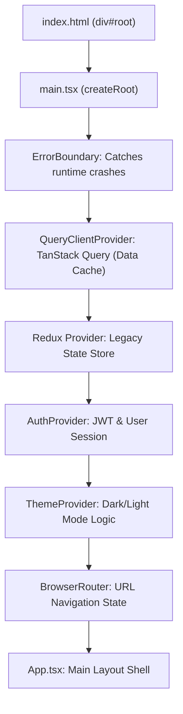
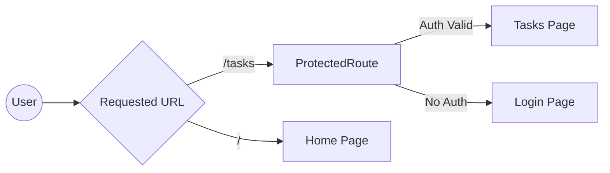
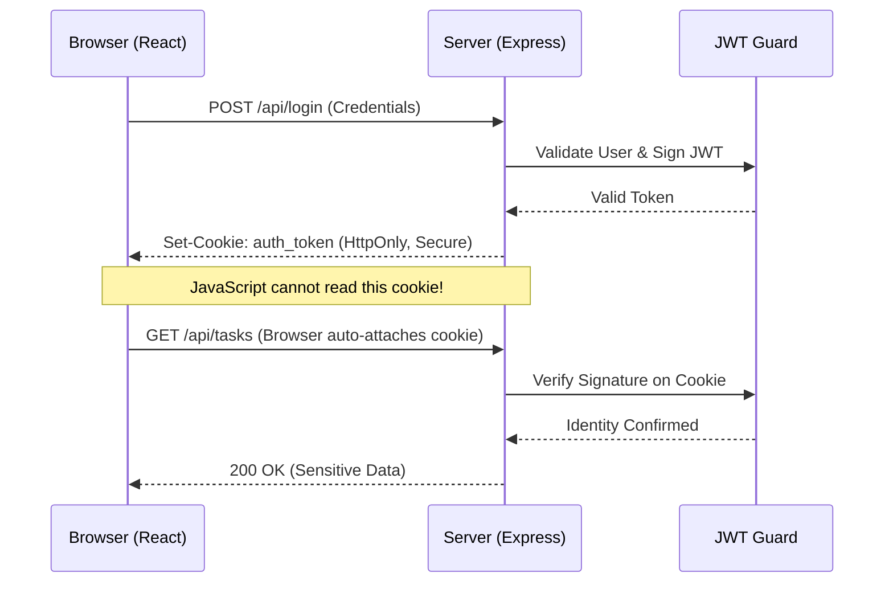

# 🌊 Full Stack Application Flow

This document provides a deep dive into the architectural mechanics of the Pro Task Manager. Understanding this flow is critical for debugging and extending the application.

---

## 1. 🚀 Bootstrap Phase (System Startup)

When you run the development environment, two major processes are initialized.

### 🟢 Backend (Express.js)
1. **Entry Point (`server.js`)**: The process starts here.
2. **Configuration**: Imports constants (PORT) and the pre-configured `app` instance.
3. **Activation**: `app.listen()` fires up the network listener on the defined port (usually 5000).

### 🔵 Frontend (Vite + React)
1. **HTML Entry (`index.html`)**: The browser loads this first.
2. **Module Loading**: Loads `<script type="module" src="/src/main.tsx">`.
3. **Compilation**: Vite performs on-the-fly compilation of TSX/TypeScript.

---

## 2. 🏗️ Frontend Initialization Pipeline

Before the user sees any content, React sets up a multi-layered environment of "Providers" in `main.tsx`.

---

## 3. 🗺️ Routing Strategy

The `AppRoutes.tsx` component acts as the Traffic Controller for the application.

- **Public Routes**: accessible to anyone (`/`, `/login`, `/signup`).
- **Protected Routes**: Wrapped in a `<ProtectedRoute />` component that checks for an active session. If no session exists, the user is redirected to `/login`.

---

## 4. 🔄 The "Full Loop" Request Cycle

This is how data moves from a user's click to the backend and back to the screen.

### Example: Loading Task List
1. **Trigger**: Component (e.g., `Tasks.tsx`) mounts.
2. **Hook Execution**: `useQuery` or a Zustand action is called.
3. **HTTP Request**: `axios` sends a GET request to `http://localhost:5000/api/tasks`.
4. **Backend Routing**: `app.js` matches the path and sends it to `taskRoutes.js`.
5. **Middleware**: `authMiddleware` validates the JWT in the cookie.
6. **Controller**: `taskController.getTasks` extracts the User ID and calls the Service.
7. **Response**: Backend sends a 200 OK JSON response.
8. **Re-render**: React detects the state update and renders the `TaskCard` components.

---

## 5. 🛡️ Security Architecture (JWT Workflow)

The application uses an **HttpOnly Cookie** strategy, which is the gold standard for protecting against XSS attacks.

---

## 🔧 Technical Stack Summary
- **Data Persistence**: Zustand Persist (Frontend) + MockDB/JSON (Backend).
- **Communication**: REST API over HTTP/JSON.
- **Styling Pipeline**: Tailwind v4 JIT Compiler -> PostCSS -> CSS Injection.
